

# Cybersecurity Management
<!-- _class: first-slide -->

**The cybersecurity career**

Juan Vera - juanvvc@gmail.com

# Contents
<!-- _class: cool-list toc -->

1. [What is cybersecurity?](#3)
1. [Cybersecurity domains and roles](#8)
1. [A cybersecurity career](#21)

# What is cybersecurity?
<!-- _class: lead -->

---
<!-- _class: center -->

So, you think computers are cool and that's why you want to work in Cybersecurity

# What do you think cybersecurity is?

- Setting up firewalls
- Update antivirus
- Enforcing strong passwords
- Encrypting communications
- Protection of the user's privacy
- Check suspicious emails

This is just the beginning!

> https://us-cert.cisa.gov/ncas/tips/ST04-001

<!-- The image on the left is a SOC: the security operations center in big companies -->

---
<!-- _class: center -->

**Cybersecurity is about making people, processes and systems better than they were before you get there**

<!--
These are more than good intentions. Notice: this definition does not include technical words. It talks first about people and processes, and then systems. It also talks about constant improvement and doing your best

We will see during this session the many aspects of cybersec

background: https://www.freeimageslive.co.uk/files/images011/beautiful_clouded_sky.jpg
-->

---

- 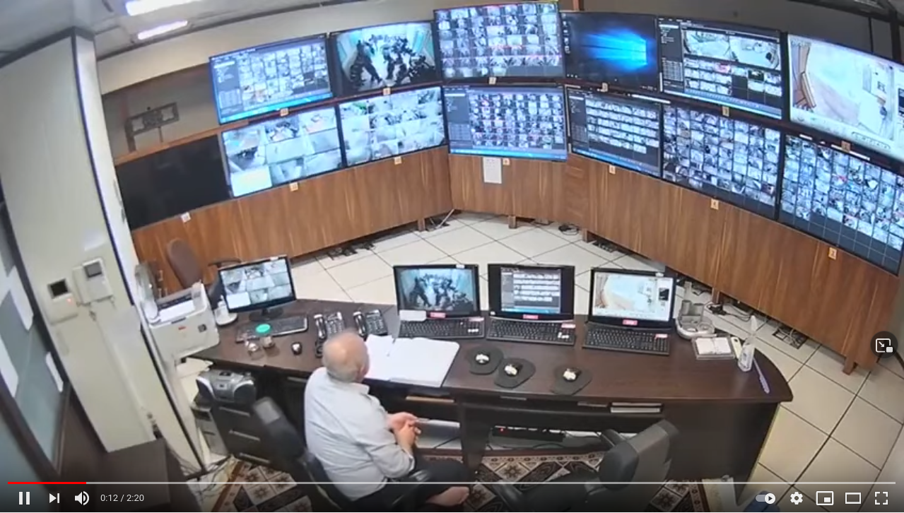
* 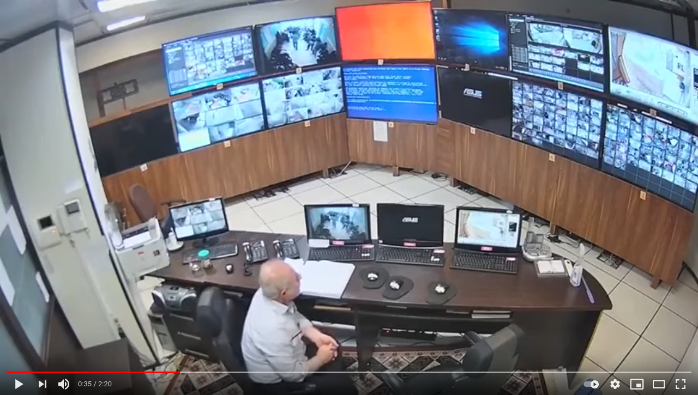
* 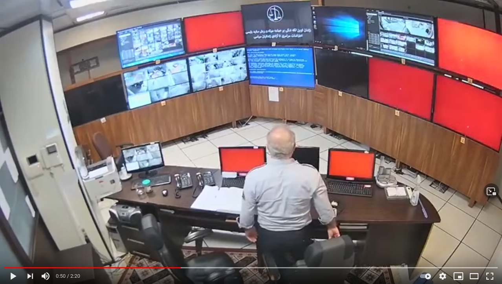
* 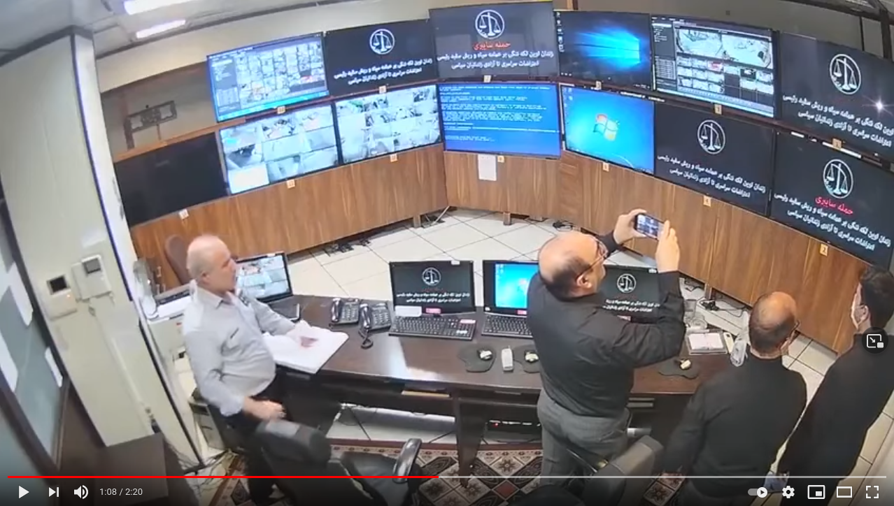

> Full video: <https://www.youtube.com/watch?v=DfibXDEnMnk> **Warning! Very disturbing images of violence and abuse after minute 1:30**
> For this presentation, check only: 0:12, 0:35, 0:50, 1:08

<!--
This is an example of an incident, and we will take advantage of this video to learn about the different roles in cybersec

On August 2021, some surveillance cameras in Iran’s Evin prison, in the capital Tehran, have apparently being hacked by a cyberactivist group.

The videos show something very similar to an incident response event like the ones you are going to face in the near future. For this presentation, we are only interested in the events shown by the camera in the security office, minutes 0:00 to 1:30 in the linked video. Warning: there are disturbing images of violence after 1:30.

- 0:12: This is a normal day in a security office center. Probably, this is going to be the entry job for many of you: monitoring systems ("SOC analysts level 1" is the technical term https://www.cybersecurity-professionals.com/jobs-1/SOC-Analyst-Tier-1 ). This is a surveillance room, but a cybsersecurity office is quite similar to this one: lots of screens showing details about your network and the actions that are happening in this moment. Notice:
- For this room to work, someone has already put in place the systems: firewalls, authentication, permissions... This is another role: the security architect. The security architect sets up the systems, but doesn't run them. An architect is a very skilled person with some years of experience
- 0:35: something is happening, but the analyst is not yet aware.
    - The screens cannot show all that is happening at this moment. Data must be filtered, only relevant events have to be shown... this is a very careful process of filtering and prioritizing data and showing alarms is made by the "SOC analyst tier 3"
- 0:50: something happened and the analyst is finally aware. He is also aware whatever is happening, it is beyond his skills. As a result, he escalates to the "tier 2".
- 1:08 The "tier 2" is a more trained / experimented team that acts when tier 1 is not enough and stat the manage the incident. In this case, they are assessing the communication. No actions are taken at this moment!

These are only some roles: preparing systems, filtering out data, monitoring, responding to incidents... Even the attackers are another role that must be taken into consideration. Let's see these roles in more detail
-->

# Cybersecurity domains and roles
<!-- _class: lead -->

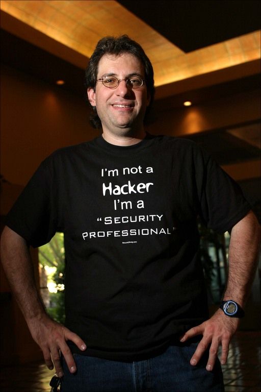

<!--
(wikipedia)
Kevin David Mitnick (August 6, 1963 – July 16, 2023) was an American computer security consultant, author, and convicted hacker. He is best known for his high-profile 1995 arrest and five years in prison for various computer and communications-related crimes. Mitnick's criminal activities, arrest, and trial, along with the associated journalism, were all controversial. Though Mitnick was convicted of copying software unlawfully, his supporters argue that his punishment was excessive and that many of the charges against him were fraudulent and not based on actual losses. After his release from prison, he ran his own security firm, Mitnick Security Consulting, LLC, and was also involved with other computer security businesses. 

Shimomura, Tsutomo; Markoff, John (1996). Takedown: The Pursuit and Capture of Kevin Mitnick, America's Most Wanted Computer Outlaw - By the Man Who Did It. Hyperion. ISBN 978-0786862108.
-->

---
<!-- _class: vertical-bottom no-logo -->

> https://www.linkedin.com/pulse/cybersecurity-domain-map-ver-30-henry-jiang/

<!--
These are the different roles in the cybersecurity field. Each one of the colors is a general domain, and each of the bubbles a specialist. You will probably develop your career moving from bubble to bubble, and occasionaly from domain to domain.
-->

---
<!-- _class: no-logo -->

<!--
These are the main domains in cybersecurity:

- Defense, avoiding the bad guys to enter the premises
- Firefighters, fixing things when things go down
- Reactive, or forensic analysists. They act after a security incident
- Hacking, to find vulnerabilities, test the security of the system or learn about new things
- Engineers, to develop the security systems
- Management roles
-->

## Cybersecurity roles
<!-- _class: cool-list -->

1. *Security engineers*
1. *Blue Team*
1. *Incident Responders*
1. *Forensics Analysts*
1. *Red team*
1. *White team*
   
This is not an exhaustive list!

## Security engineers/architect

- Security **design**
- Install/configure/maintain/update the systems: firewalls, EDRs...
- Operate the cloud
- DevSecOps, sysadmins
- Threat modeling and vulnerability management
- Usually, not an entry point: very technical role

**Goal**: a secure system

<!--
Photo: https://lawkm.com/wp-content/uploads/2017/08/shutterstock_394918033.jpg
-->

## Blue Team
<!-- _class: with-info -->

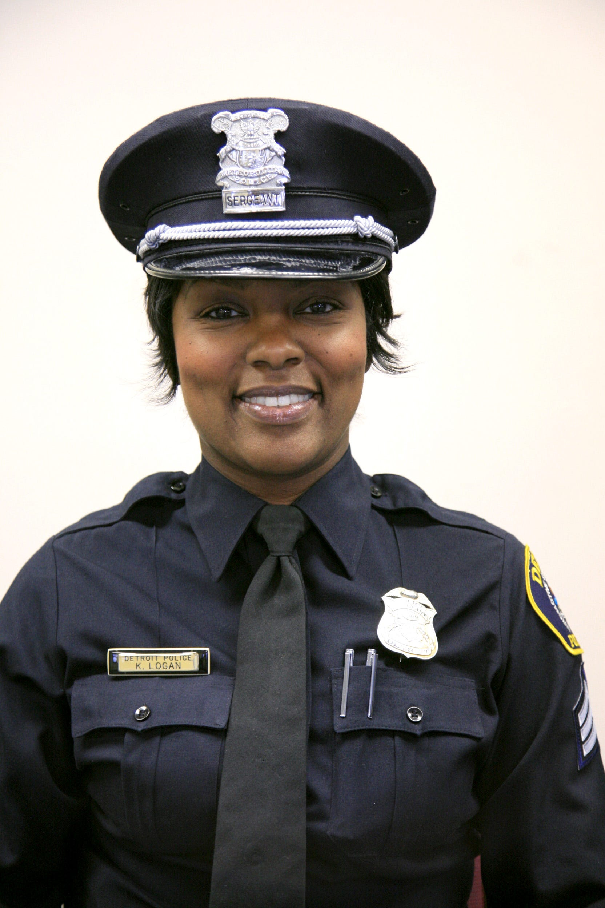

- Security **operation/analyst**
- Filter logs, set alarms...
- Identify bad behavior: monitoring
- Define security policies and good practices: policy makers
- Other specialists: threat intelligence / analysts
- Also: help desk

**Goal**: defensive security

<!--
Photo: https://www.gannett-cdn.com/media/2018/05/22/DetroitFreeP/DetroitFreePress/636625890103757998-22966-Kimberly-Blackwell.JPG
-->

**This is an entry point!**

> https://csrc.nist.gov/glossary/term/Blue_Team

<!-- 

There are several "sub-roles" inside the blue team:

- Security Office Center tier 1: monitor systems and respond to common security events
- SOC tier 2: respond to exceptional security events
- SOC tier 3: configure alarms, filter data...
- Threat intelligence: learn about current attacks and check if your company has the defenses against them
- Define alarms and playbooks

They are usually the security department of a company, in the IT department, and they work on-premises.

Large companies are starting to outsource the monitoring of the security systems,
and the SOC (i.e., "the monitoring") is run by an external entity.

Skills: reading, detailed-oriented, kwowledge about a security product. No coding required!
-->

## Incident Responders

- Something happened!
- Identify affected systems
- How did the attackers enter the system?
- Remediate
- Eradicate
- Negotiate with the attackers
- Time is important!
- Not an entry point: highly skilled and experienced

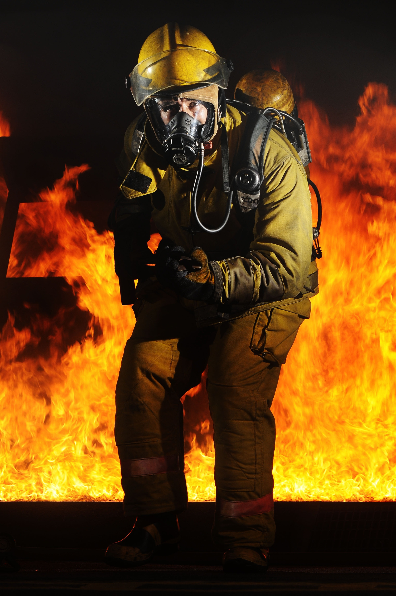

**Goal**: mitigate and remediate security breaches

<!--
Incident responders act when an intrusion is confirmed.

You have seen this many times in movies: https://www.youtube.com/watch?v=msX4oAXpvUE

They must identify:

-  which systems were affected. It is not an easy task. For example, during a ransomware, the entry point used by the attackers is probably NOT encrypted.
- the attackers usually leave "persistence mechanisms" to be able to enter the company again after the incident
- is there information leak apart from the ransomware?

Notice: when an incident responder acts, the security systems already failed. Firewalls, antiviruses... they are of little use. The tools and skills they use are different.

The Incident Response team is nearly always externalized, outsourced to a specialized company

Skills: very good communication skills and cold blood

Photo: https://c1.peakpx.com/wallpaper/76/787/715/training-portrait-firefighter-fire-wallpaper.jpg

-->

## Forensic Analysts

- Investigate special security events
- What happened, in depth?
- Can we prosecute the attackers?
- Time is not important
- In Europe, they are usually independant consultants and not an entry point, or they work in law enforcement

**Goal**: identify causes and criminals

<!--

You have seem this many times in movies: https://www.youtube.com/watch?v=Vxq9yj2pVWk

A forensic analysts:

- investigates some special security events that the SOC cannot decide if there was an intrusion or not. For example, there is some logon attempts from the machine used by the company CEO and monitoring is not enough. The antivirus does not say something. Is is compromised?
- Identify the identity of the bad guys. Can we prosecute them? Did they receive assistance from someone inside?
- Act as Expert Witness in a trial

Forensics analysts check very carefully a security event. Time is usually not important to them.

Forensic analysts, specially if they must act as Expert Witness, are external to a company

-->

## Red Team
<!-- _class: with-info -->

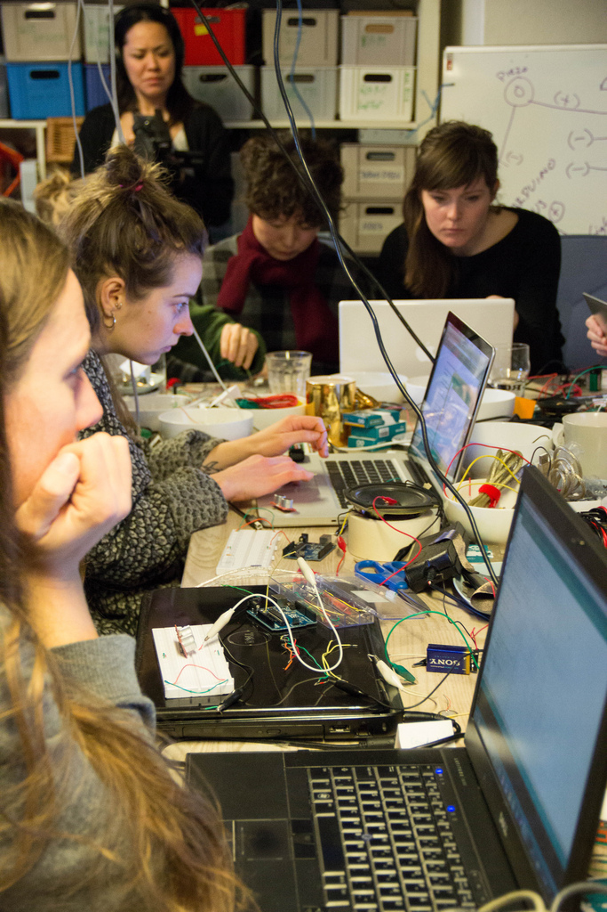

- "Fake and controlled attacks" 
- The Blue Team do not know when the Red Team attacks
- Training for the Blue Team
- Also: pentesters, vulnerability scanners...

**Goal**: test the organization's detection and response capabilities and detect problems before the bad guys

**This is an entry point!**

<!--
most of the time, nothing happens. You need to have a good trained blue team, up to date with the last threats and vulnerabilities, and their procedures and tools must be checked regularly. You need false attacks to test the capabilities of your blue team.

The reds act as a simulated attacker

The goals, extends and tools are previously defined with the management! Do not run a red team exercise without consent!

The terms of the red team exercises are negotiated. For example, whether or not they are allowed to have internal help

The blue team is NOT aware that a red team was hired. They have to manage the incident as a real attack, if they are able to detect the attack

Skills: hack-the-box, meterpreter, basic scripting...

Photo: https://mythologicalquarter.net/wp-content/uploads/2013/10/8589170182_ed4dd50bb8_b.jpg

-->

## Managers and security officers

- Chief information security officer (CISO)
- Manage the Security department, external SOC...
- Communicate breaches externaly and internaly
- They know about red team exercises
- Audits, security policies, response plans...
- Compliance, legal, security awareness...
- Definitely not an entry point

**Goal**: cybersecurity governance

> https://csrc.nist.gov/glossary/term/White_Team
<!--
Photo: https://c.pxhere.com/images/08/bf/10bfc2d611e5b331070a4cfa8e0d-1444567.jpg!d
-->

## Other roles

- Teaching
- Sales engineer
- Identity management
- Developer of cybersecurity solutions
- Purple team: red + blue team
- An attacker
- ...

<!--
background: https://bakerstuart.com/wp-content/uploads/2016/04/chagin.jpg
-->

---
<!-- _class: center -->

<!--
This is a typical organigram for the cybersecurity departments of a big company

The CISO (Chief Information Security Officer) is the main responsible of the cybersec in an organization. It can report directly to the CEO (general manager of the company) or to the CIO (Chief Information Officer, he/she manages all other aspects of the information technologies) Check: https://blogs.cisco.com/security/should-the-ciso-report-to-the-cio

Many companies cannot afford to have dedicated departments, and some of these are oursourced. For example, it is common outsourcing the Security Operations Center, the Incident Management and the Red Teams, specialy if cyber is not your core business.
-->

---

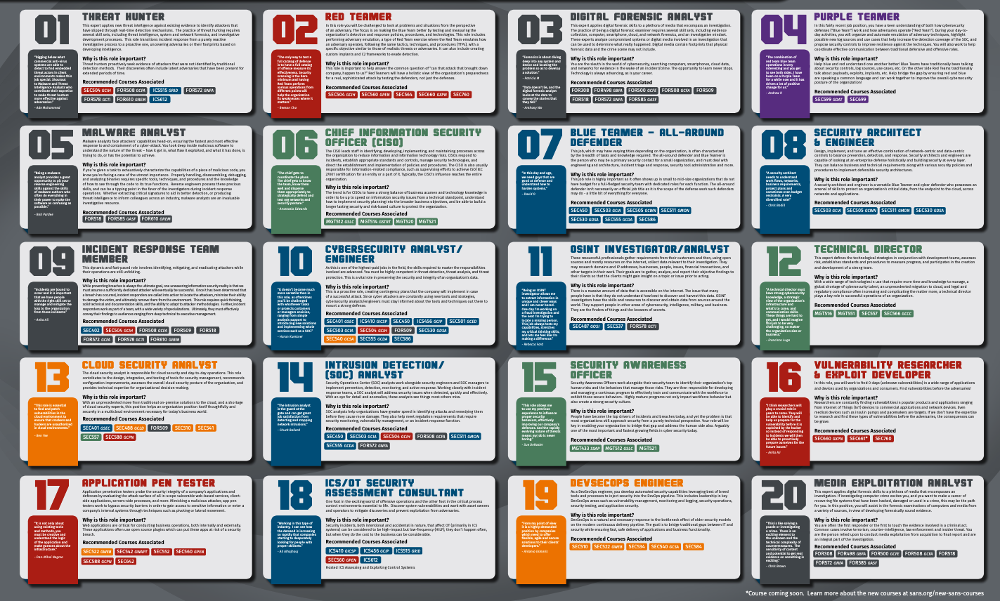

> https://www.sans.org/cybersecurity-careers/20-coolest-cyber-security-careers/

<!--
You will be a specialist in one of these roles, but your day to day work probably involves different roles at different times. Also, while you develop your career, you are going to jump from one role to another.
-->

# A cybersecurity career
<!-- _class: lead -->

---
<!-- _class: two-columns -->

**Pros**

- Flexible hours
- Good salaries
- Remote work
- A large diversity of positions and specialties
- Recruiters look for you
- You can train yourself

**Cons**

- Entry-level has prerequisities: experience required
- Business not always understand cyber
- Change is rapid and never stops
- Criminals don't take vacations or weekends
- Serious passion required
- Mental burnout
- Jack of all trades and master of none

---

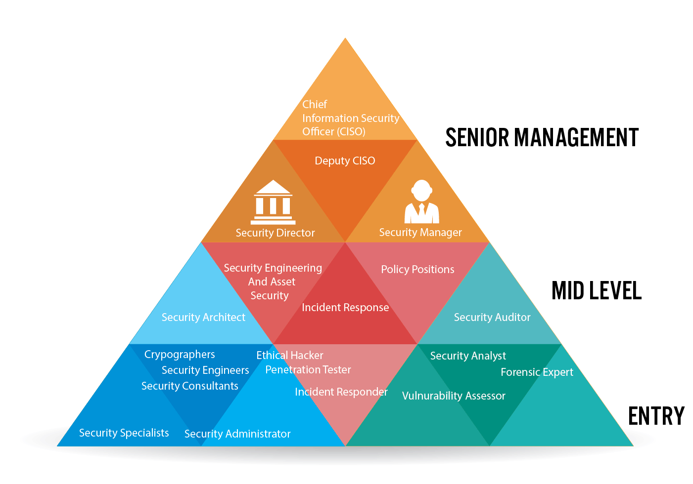

> https://www.cybersecuritydegrees.com/faq/prepare-career-cyber-security/

## Certifications

**Don't expect master every subject**

New threats, new tools, new techniques

Knowledge must be updated constantly

Certifications: private degrees on some specific field

Courses take from weeks or months

Some certifications expire and must be renewed

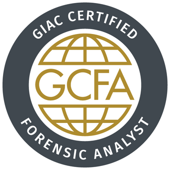

---

[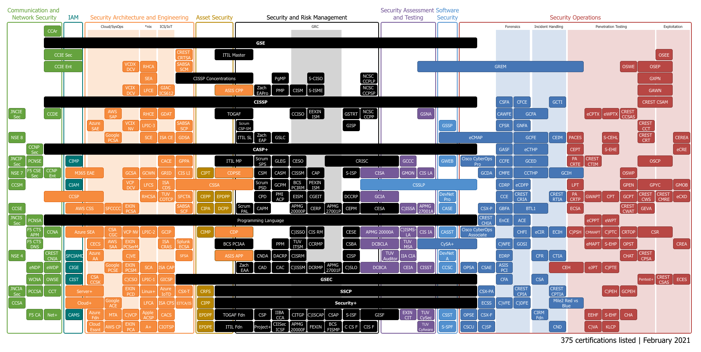](https://pauljerimy.com/security-certification-roadmap/)

> https://pauljerimy.com/security-certification-roadmap/

---
<!-- _class: smaller-font -->

Certification|LinkedIn|Price
--|--|--
CISSP|48,711|800 €
CISA|12,466|800 €
CISM|8,860|800 €
Security+|5,371|400 €
CEH|5,894|1000 €
GSEC|3,633|>7000 €
SSCP|3,682|400 €
CASP|2,918|500 €
GCIH|2,872|>7000 €
OSCP|2,798|>1000 €

> https://www.coursera.org/articles/popular-cybersecurity-certifications

## Cybersecurity skills
<!-- _class: smaller-font with-warning -->

- Risk Assessment
- Splunk / QRadar / Elastic
- Digital Forensics
- Penetration Testing
- Team work and collaboration
- Problem-solving
- Research and learn new information
- Customer service skills: empathy
- **Very effective communication**
- Technical writing skills
- Research and independent learning

Soft skills are as important than technical skills!

> https://bootcamp.berkeley.edu/blog/cybersecurity-skills/
> https://redcanary.com/blog/strong-communicators/
> https://blog.notso.pro/2022-06-12-avoiding-cyber-nihilism/

<!-- 

Technical knowledge is only a part of the skill set!
 -->

 ---

[meg (@cybersecmeg)](https://twitter.com/cybersecmeg/status/1414680565563936772?ref_src=twsrc%5Etfw) 
i wish more cybersecurity professionals would realize they’re not just protecting data and assets - you’re protecting people’s jobs, livelihoods, and families. if your organization goes under because of an incident - who will remain employed when the company ceases to exist?
(*Jul 12, 2021*)

---

[SwiftOnSecurity (@SwiftOnSecurity)](https://twitter.com/SwiftOnSecurity/status/1486115334868324355)
Posit: InfoSec is such a large field there are areas where past experience is uniquely valuable, areas you can jump right to from college, situations that demand the cool hand of a former retail worker, and areas you couldn't make me do even under threat of a metal rake to my car
(*Jan 26, 2022*)

<!--
1 out of every 4 detected 0-day exploits could potentially have been avoided if a more thorough investigation and patching effort were explored. Across the industry, incomplete patches — patches that don’t correctly and comprehensively fix the root cause of a vulnerability — allow attackers to use 0-days against users with less effort.

> https://googleprojectzero.blogspot.com/2021/02/deja-vu-lnerability.html
-->

## Burn-out syndrome

Cybersec is very demanding:

- Dealing with attackers
- Dealing with clients
- Dealing with IT
- New techniques and vuls every week
- Tons of different tools to learn
- Up to date information is not always accesible
- Attacks are usually at night or during the weekends
- This is a war and we are not winning

> https://www.securitymagazine.com/blogs/14-security-blog/post/93890-five-tips-to-avoid-cybersecurity-burnout
> https://www.zdnet.com/article/cybersecurity-is-tough-work-so-beware-of-burnout/
> https://www.securew2.com/blog/combating-burnout-in-cybersecurity

<!--
Image: https://www.securew2.com/wp-content/uploads/2020/03/how-to-prevent-workplace-burnout-on-your-team.png
-->

## Imposter syndrome

> https://www.defeatingepilepsy.org/living-with-epilepsy-series/imposter-syndrome/
> https://news.wecyberup.org/cy-says-blog/overcoming-imposter-syndrome-in-cybersecurity

## Take care of yourself

- Use automation and reduce daily scanning
- Take breaks away from your computer
- Go outside often
- Don't bite more than you can chew
- Take a vacation
- Seek professional help
- Learn new tools and teach

<!--
Current cybersecurity is a complex and huge field. You are not expected to know every small detail about all systems or every possible technique, not only because the unfathomable amount of information but also because this knowledge will be outdated in months. Aiming to complete knowledge will be a source of stress and frustration. Please, check the links in the first session or search for "occupational burnout syndrome", "SOC analyst burnout", and "impostor syndrome". I truly believe that learning about these syndromes is going to be very useful for you or for the people you will lead in the future.

On the contrary, you are expected to know about how to search information about current attacks, have high analytical skills, being able to prioritize the relevant leads among all the possible evidences and efficiently communicate your findings. You are most probably going to be specialized on a specific path (red, blue, incidents, forensics...), but the specialization will come naturally after some time in the field, probably years.

You are not going to be alone. You are going to be part of a team that will teach and will mentor you. Gathering a security team inside a large company, or creating a small company to offer security services to some big companies, is very similar to gathering a group in a RPG game: you need a soldier, a magician, and a thief; i.e., you need someone specialized in blue, a forensic analyst and a red. Like in a RPG game, you begin as a low level character and you will gain knowledge and experience learning from other team members, earning some certification (1st session), playing CTFs (3rd session) or during real battles against the bad guys. You'll spend more time in the lab, writing reports or attending a brainstorming meeting than running commands.

Check, for example, all comments in this thread in twitter: https://twitter.com/TinkerSec/status/1423864769271017476

There are lots of things to do in cybersecurity and these sessions are just presenting the huge oportunities to you.
-->

## Choose a career
<!-- _class: cool-list -->

1. *Find your passion*
2. *Identify your strengths*
3. *Create a list of dream jobs*
4. *Create a list of companies*
5. *Keep learning and exploring*
6. *Jump between positions when necessary*

## Cybersecurity Companies operating in Catalonia

> https://ciberseguretat.gencat.cat/es/detalls/noticia/La-Ciberseguretat-a-Catalunya-2020.-Informe-de-ACCIO-y-la-Agencia-de-Ciberseguretat-de-Catalunya

# References

- [I Want to Work in Cybersecurity... Whatever That Means!](https://www.youtube.com/watch?v=hFgg0Xas4CI&list=PLtgaAEEmVe6AmhtkQA35LWWCag2hHlHqo) - Ryan Kovar, SANS Summit 2021
- "Cybersecurity Career Master Plan", Gerald Auger, Jaclyn Scott, Jonathan Helmus, Kim Nguyen. Packt> 2021. ISBN 978-1-80107-356-1

<!--
The first reference is a SANS summit specialized in what to expect when you are starting a cybersecurity career. Check the playlist: many sessions on the matter!

The second reference is a commercial book. It is usually on sale in Humble Bundle.
-->

# Thanks!
<!-- _class: last-slide -->
