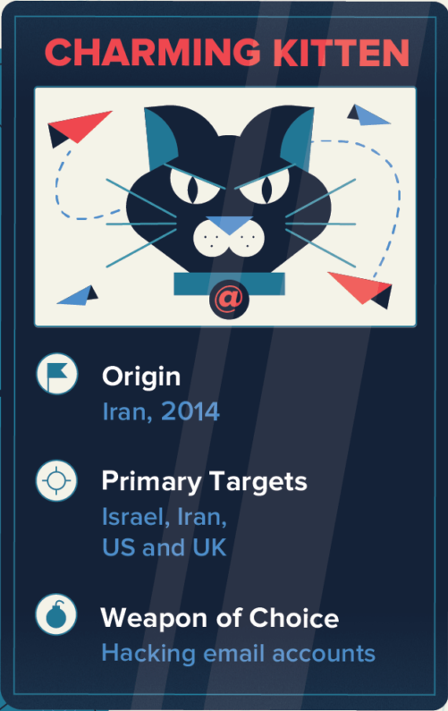

# Cybersecurity Management
<!-- _class: first-slide -->

**The cybersecurity careers**

Juan Vera - juan.vera@upc.edu

---
<!-- _class: center -->

So, you think computers are cool and that's why you want to work in Cybersecurity

# What do you think cybersecurity is?

- Setting up firewalls
- Using strong passwords
- Encrypting communications
- Protecting the privacy of the user
* Actually, this is only the beginning

> https://us-cert.cisa.gov/ncas/tips/ST04-001

---
<!-- _class: center -->

**Cybersecurity is about making people, processes and systems better than they were before you get there!**

---

- 
* 
* 
* 

> Full video: https://www.youtube.com/watch?v=DfibXDEnMnk **Warning! Very disturbing images of violence and abuse after minute 1:30**
> For this presentation, check only: 0:12, 0:35, 0:50, 1:08

<!--
On August 2021, apparently hacked videos of surveillance cameras in Iran’s Evin prison, in the capital Tehran, have confirmed many of the patterns of abusive treatment and violations of due process human rights groups have documented for decades. We are only interested in the events
shown by the camera in the security office, minutes 0:00 to 1:30 in the linked video.

- 0:12: This is a normal day in a security office center. Probably, this is going to be the entry job for many of you: monitoring ("SOC analysts level 1" is the technical term https://www.cybersecurity-professionals.com/jobs-1/SOC-Analyst-Tier-1 ). This is a surveillance room, but a cybsersecurity office is quite similar to this one: lots of screens showing details about your network and the actions that are happening in this moment. Notice:
    - For this to work, someone has already put in place the systems: firewalls, authentication, permissions... This is the security architect.    
- 0:35: something is happening, but the 
    - The screens cannot show all that is happening at this moment. Data must be filtered, only relevant events have to be shown... this is a very careful process of filtering and prioritizing data and showing alarms is made by the "SOC analyst tier 3"
- 0:50: something happened and the analyst is finally aware. He is also aware whatever is happening, it is beyond his skills. As a result, he escalates to the "tier 2".
- 1:08 The tier 2 is a more trained / experimented team that acts when tier 1 is not enough and stat the manage the incident.

These are only some roles: preparing systems, filtering out data, monitoring, responding to incidents... Even the attackers are another role that must be taken into consideration. Let's see these roles in more detail
-->

# Contents
<!-- _class: cool-list toc -->

1. [Bad guys](#6)
1. [Good guys](#12)
1. [A cybersecurity career](#20)

# Bad guys
<!-- _class: lead white-logo -->

## Ransomware-as-a-service
<!-- _class: center -->

> https://www.upguard.com/blog/what-is-ransomware-as-a-service

<!--
The bad guys have many different motivations: money is the most important motivation, but also stealing industrial secrets or political motivations, as in the previous video.

Being a criminal is not that hard, you only need money to buy the right tools. And they are not event too expensive

- Malware / ransomware creators sell their tools in the black market. It is a completely professionalized business : they have 24/7 technical support from the developers and detailed manuals (playbooks)

- That means that many groups share the same tools and techniques, and they do not need a very deep technical knowledge
-->

---

> https://www.microsoft.com/security/blog/2022/05/09/ransomware-as-a-service-understanding-the-cybercrime-gig-economy-and-how-to-protect-yourself/

## Advanced Persistent Threat Groups

- APT groups try to steal data, disrupt operations or destroy infrastructure.
- APT attackers pursue their objectives over months or years.
- They adapt to cyber defenses and frequently retarget the same victim.

> https://www.varonis.com/blog/apt-groups/
> https://www.fireeye.com/current-threats/apt-groups.html

<!--
Some of these groups are APT. They are focused during large periods of time on a specific victim and they are very well funded and organized.

These groups are very well know and documented!
-->

---

- APT41 is a threat group that researchers have assessed as Chinese state-sponsored espionage group that also conducts financially-motivated operations.
- APT41 has been active since as early as 2012.
- The group has been observed targeting healthcare, telecom, technology, and video game industries in 14 countries.

> https://www.fbi.gov/wanted/cyber/apt-41-group
> https://attack.mitre.org/groups/G0096/
> https://www.fireeye.com/current-threats/apt-groups.html
> https://en.wikipedia.org/wiki/Double_Dragon_(hacking_group)

<!--
This is just an example of one of these groups. Notice:

- The group is perfectly identified
- The group has been active for 10 years
- They are suspected to be supported by the Chinese goverments
- This is APT 41... and that implies that there are at least other 40  groups! Check the link to MITRE, they have the list of other groups and their methods and techniques
-->

## Ramsonware groups in July, 2021

> [Christiaan Beek in Twitter, 2021](https://twitter.com/ChristiaanBeek/status/1427569852357693440)

<!--
Do you notice something funny?

No China, no Russia. These countries are suspected to offer "free haven" to cybercriminals, if they do not attack to companies in their countries

Some ransomware quits without doing any harm if they detect the OS language/keyboard is Russian!

-->

## The bad guys are winning

* There’s a (...) silent, invisible war. It’s fierce and continues to escalate
* They are aggressive, hard-working, learning, inventing and focused on the goal of making money
* They only have to be right once: a vulnerability, a missing patch, a badly secured system, a weak password...
* The criminals are almost never caught

> https://www.forbes.com/sites/davidblack/2021/05/26/cyber-security-heres-why-the-bad-guys-are-winning/
> https://www.infosecurity-magazine.com/next-gen-infosec/cybercriminals-winning-fight/

# Good guys
<!-- _class: lead -->

---
<!-- _class: vertical-bottom -->

> https://www.linkedin.com/pulse/cybersecurity-domain-map-ver-30-henry-jiang/

<!--
There are a lot of different roles in cybersecrity. This is only an example:

- defense, avoiding the bad guys to enter the premises
- firefighters, fixing things when things go down
- reactive, or forensic analysists. They act after a security incident
- hacking, to find vulnerabilities, test the security of the system or learn about new things
- management roles
-->

---

## Cybersecurity roles
<!-- _class: cool-list -->

1. *Security Architects*
1. *Blue Team*
1. *Incident Responders*
1. *Forensics Analysts*
1. *Red team*
1. *White team*

<!--
And, of course, being a trainer!
-->

## Security architects

- Security **design**
- Configure the systems: firewalls, EDRs...
- Define the security infrastructure
- Operate the cloud
- DevSecOps
- System administrators, programmers

**Goal**: a secure system

## Blue Team

- Security **operation**
- Filter logs, set alarms...
- Identify bad behavior: monitoring
- Define security policies and good practices: policy makers
- Threat intelligence, they know current attacks

**Goal**: defensive security

> https://csrc.nist.gov/glossary/term/Blue_Team

<!-- 

The video linked above showed the blue team in an enterprise.

There are several "sub-roles" inside the blue team:

- Security architects, configure firewalls
- Security Office Center tier 1: monitor systems and respond to common security events
- SOC tier 2: respond to exceptional security events
- SOC tier 3: configure alarms, filter data...

They are usually the security department of a company, in the IT department, and they work on-premises.

Large companies are starting to outsource the monitoring of the security systems,
and the SOC (i.e., "the monitoring") is run by an external entity.

We will have at least one session dedicated to the blue team in this course.
-->

## Incident Responders

- Identify affected systems
- Entry points
- Remediate
- Eradicate
- Negotiate with the attackers
- Time is important!

**Goal**: mitigate and remediate security breaches

<!--
Incident responders act when an intrusion is confirmed.

You have seen this many times in movies: https://www.youtube.com/watch?v=msX4oAXpvUE

They must identify:

-  which systems were affected. It is not an easy task. For example, during a ransomware, the entry point used by the attackers is probably NOT encrypted.
- the attackers usually leave "persistence mechanisms" to be able to enter the company again after the incident
- is there information leak apart from the ransomware?

Notice: when an incident responder acts, the security systems already failed. Firewalls, antiviruses... they are of little use. The tools and skills they use are different.

The Incident Response team is nearly always externalized, outsourced to a specialized company.
-->

## Forensic Analysts

- Investigate special security events
- What happened?
- Can we prosecute the attackers?
- What can we do to enhance the systems?
- Time is not important

**Goal**: identify causes and criminals

<!--

You have seem this many times in movies: https://www.youtube.com/watch?v=Vxq9yj2pVWk

A forensic analysts:

- investigates some special security events that the SOC cannot decide if there was an intrusion or not. For example, there is some logon attempts from the machine used by the company CEO and monitoring is not enough. The antivirus does not say something. Is is compromised?
- Identify the identity of the bad guys. Can we prosecute them? Did they receive assistance from someone inside?
- Act as Expert Witness in a trial

Forensics analysts check very carefully a security event. Time is usually not important to them.

Forensic analysts, specially if they must act as Expert Witness, are external to a company

-->

## Red Team

- Red Team Exercice = "Fake and controlled attack" 
- The Blues do not know when the Reds attack
- Training for the Blues
- Also: pentesting, vulnerability scan...

**Goal**: test the organization's detection and response capabilities

<!--
most of the time, nothing happens. You need to have a good trained blue team, up to date with the last threats and vulnerabilities, and their procedures and tools must be checked regularly. You need false attacks to test the capabilities of your blue team.

The reds act as a simulated attacker

The goals, extends and tools are previously defined with the management! Do not run a red team exercise without consent!

The terms of the red team exercises are negotiated. For example, whether or not they are allowed to have internal help

The blue team is NOT aware that a red team was hired. They have to manage the incident as a real attack, if they are able to detect the attack

-->

## Managers and White Team

- Chief information security officer (CISO)
- Manage the Security department, external SOC...
- Communicate breaches
- They know about red team exercises
- Audits, security policies, response plans...

**Goal**: manage the others

> https://en.wikipedia.org/wiki/Chief_information_security_officer
> https://csrc.nist.gov/glossary/term/White_Team

---

> https://www.sans.org/cybersecurity-careers/20-coolest-cyber-security-careers/

<!--
You will be a specialist in one of these roles, but your day to day probably involves different roles at different times. Also, during your career, your are going to jump from one role to another.
-->

# A cybersecurity career
<!-- _class: lead -->

---
<!-- _class: two-columns -->

### Pros

- Flexible hours
- Good salaries
- Remote work
- A large diversity of positions and specialties
- Recruiters look for you
- You can train yourself

### Cons

- Entry-level has prerequisities: experience required
- Business not always understand cyber
- Change is rapid and never stops
- Criminals don't take vacations or weekends
- Serious passion required
- Mental burnout
- Jack of all trades and master of none

---

> https://www.cybersecuritydegrees.com/faq/prepare-career-cyber-security/

## Certifications

**Don't expect master every subject**

New threats, new tools, new techniques

Knowledge must be updated constantly

Certifications: private degrees on some specific field

Courses take from weeks or months

Some certifications expire and must be renewed

---

> https://pauljerimy.com/security-certification-roadmap/

---
<!-- _class: smallest-font -->

Certification|LinkedIn|Price
--|--|--
CISSP|48,711|800 €
CISA|12,466|800 €
CISM|8,860|800 €
Security+|5,371|400 €
CEH|5,894|1000 €
GSEC|3,633|>7000 €
SSCP|3,682|400 €
CASP|2,918|500 €
GCIH|2,872|>7000 €
OSCP|2,798|>1000 €

> https://www.coursera.org/articles/popular-cybersecurity-certifications

## Cybersecurity skills
<!-- _class: smaller-font with-info -->

- Risk Assessment
- Linux / Windows server Administration
- Splunk / QRadar / Elastic
- Digital Forensics
- Penetration Testing
- Team work and collaboration
- Problem-solving
- Research and learn new information
- Customer service skills: empathy
- Very effective communication
- Technical writing skills
- Research and independent learning

> https://bootcamp.berkeley.edu/blog/cybersecurity-skills/

<!-- 

Technical knowledge is only a part of the skill set!
 -->

 ---

 [meg (@cybersecmeg)](https://twitter.com/cybersecmeg/status/1414680565563936772?ref_src=twsrc%5Etfw) 
i wish more cybersecurity professionals would realize they’re not just protecting data and assets - you’re protecting people’s jobs, livelihoods, and families. if your organization goes under because of an incident - who will remain employed when the company ceases to exist?
(*Jul 12, 2021*)

---

 [SwiftOnSecurity (@SwiftOnSecurity)](https://twitter.com/SwiftOnSecurity/status/1486115334868324355)
Posit: InfoSec is such a large field there are areas where past experience is uniquely valuable, areas you can jump right to from college, situations that demand the cool hand of a former retail worker, and areas you couldn't make me do even under threat of a metal rake to my car
(*Jan 26, 2022*)

<!--
1 out of every 4 detected 0-day exploits could potentially have been avoided if a more thorough investigation and patching effort were explored. Across the industry, incomplete patches — patches that don’t correctly and comprehensively fix the root cause of a vulnerability — allow attackers to use 0-days against users with less effort.

> https://googleprojectzero.blogspot.com/2021/02/deja-vu-lnerability.html
-->

## Burn-out syndrome
<!-- _class: smaller-font -->

Cybersec is very demanding:

- Dealing with attackers
- Dealing with clients
- Dealing with IT
- New techniques every week
- New vulnerabilities every week
- Tons of different tools
- Up to date information is not always accesible
- Attacks are usually at night or during the weekends
- This is a war and we are not winning

**Take care of yourself**

> https://www.zdnet.com/article/cybersecurity-is-tough-work-so-beware-of-burnout/
> https://www.securew2.com/blog/combating-burnout-in-cybersecurity

<!--
Current cybersecurity is a complex and huge field. You are not expected to know every small detail about all systems or every possible technique, not only because the unfathomable amount of information but also because this knowledge will be outdated in months. Aiming to complete knowledge will be a source of stress and frustration. Please, check the links in the first session or search for "occupational burnout syndrome", "SOC analyst burnout", and "impostor syndrome". I truly believe that learning about these syndromes is going to be very useful for you or for the people you will lead in the future.

On the contrary, you are expected to know about how to search information about current attacks, have high analytical skills, being able to prioritize the relevant leads among all the possible evidences and efficiently communicate your findings. You are most probably going to be specialized on a specific path (red, blue, incidents, forensics...), but the specialization will come naturally after some time in the field, probably years.

You are not going to be alone. You are going to be part of a team that will teach and will mentor you. Gathering a security team inside a large company, or creating a small company to offer security services to some big companies, is very similar to gathering a group in a RPG game: you need a soldier, a magician, and a thief; i.e., you need someone specialized in blue, a forensic analyst and a red. Like in a RPG game, you begin as a low level character and you will gain knowledge and experience learning from other team members, earning some certification (1st session), playing CTFs (3rd session) or during real battles against the bad guys. You'll spend more time in the lab, writing reports or attending a brainstorming meeting than running commands.

Check, for example, all comments in this thread in twitter: https://twitter.com/TinkerSec/status/1423864769271017476

There are lots of things to do in cybersecurity and these sessions are just presenting the huge oportunities to you.
-->

## Choose a career
<!-- _class: cool-list -->

1. *Find your passion*
2. *Identify your strengths*
3. *Create a list of dream jobs*
4. *Create a list of companies*
5. *Keep learning and exploring*
6. *Jump between positions when necessary*

## Cybersecurity Companies operating in Catalonia

> https://ciberseguretat.gencat.cat/es/detalls/noticia/La-Ciberseguretat-a-Catalunya-2020.-Informe-de-ACCIO-y-la-Agencia-de-Ciberseguretat-de-Catalunya

# References

- [I Want to Work in Cybersecurity... Whatever That Means!](https://www.youtube.com/watch?v=hFgg0Xas4CI) - Ryan Kovar, SANS Summit 2021
- "Cybersecurity Career Master Plan", Gerald Auger, Jaclyn Scott, Jonathan Helmus, Kim Nguyen. Packt> 2021. ISBN 978-1-80107-356-1

<!--
The first reference is a SANS summit specialized in what to expect when you are starting a cybersecurity career.

The second reference is a commercial book. It is usually on sale in Humble Bundle.
-->

# Thanks!
<!-- _class: last-slide -->
