# Cybersecurity Management
<!-- _class: first-slide -->

SOC, SIEM and Threat Hunting

Juan Vera - juan.vera@upc.edu

# Contents<!-- _class: cool-list -->

1. [A windows network](#3)
1. [The Cyber Kill Chain](#7)
1. [Defenses](#15)
1. [Security Office Center](#40)
3. [The SOC analyst](#47)
4. [Recommendations](#57)
5. [References](#63)

---

> https://www.youtube.com/watch?v=ASsJKc6HCf8

<!--
In this video, Hitler is a CISO (Chief Information Security Officer) during the aftermatch of a red team exercise

There are lots of information in this video. Every sentence introduces an important concept for the blue team. Our goal of this sessions is understanding all of these jokes.

Transcript:

- We have linked this activity to the Red Team: bunch of laptops and servers were connecting to a C2 server; initial access was gained from a phishing campagin; two users downloaded a malicious word document; which then dropped Cobal Strike
- Ok, but our security tools stopped them before they did anything bad?
- My CISO... they... they were able to get domain admin, enough to ransomware eveything
- I only want Incident Response, Threat Intelligence and the SOC leads. The rest, get out.
- This is a bloody joke! To get pwned by those red team wankers! Do  you have any idea how much money we spent on fancy tooling last year? I'm taking back your extra wide curved monitors! The new Macbooks are gone too! How could you allow this to happen? We did how many table top exercises last year, and each time you said we won!
- My CISO, they managed to unhook the EDR
- I don't care if they unbuttoned your favourite shirt!
- My CISO, they were very advanced
- This bloody EDR you made mu buy was supposed to be advanced! "Gartner Magic Quadrant what what" - my arse! You made me sit through how many vendor meetings, showing these staged simulations. "We stop this" and "we block that". For months and months we worked to get it deployed. Execs phoning ME when their torrents get blocked. I told the board no one could hack us now. And these Red wankers walk in with a macro in a spreadsheet. Fantastic! I used to enjoy this job. I woke up in the morning full of energy to take anything. I was an infosec influencer!  And what do I do now? Remedial action after remedial action given to me by kids not even half my age!
-->

# A Windows network
<!-- _class: lead -->

---
<!--
_color: white
-->

Microsoft Windows is the most used Operating System in companies

- Windows Desktop 10
- Windows Server 2022

Attackers target Windows most than any other OS in the world

---

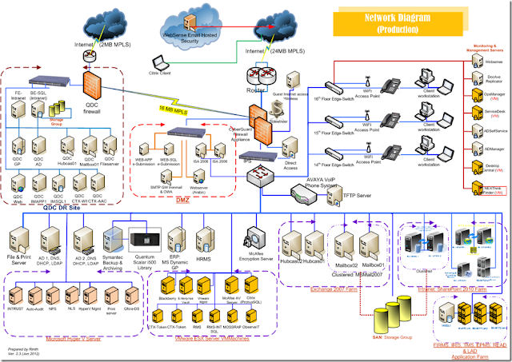

<!--

A windows network might be very complex, with tens of thousand of devices talking to each other. Some services must be centralized in the Active Directory

-->

## Active Directory (AD)
<!-- _class: two-columns -->

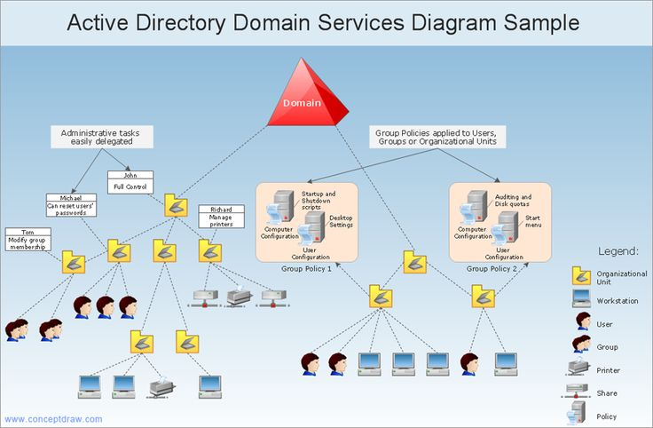

- Directory service: list of users, endpoints...
- User management: authentication, authorizations...
- DNS
- DHCP
- ...
- Usually, distributed in several Windows Servers

<!--

The Active Directory (AD) is the central console to manage Windows systems inside a network.

The AD centralizes authentication and permissions
-->

## Types of users
<!-- _class: with-info -->

- Local users: they use a single computer
- Local administrators: manage a single computer
- SYSTEM: the kernel
- Domain Users: they can use any computer
- Domain Administrators: manage the AD

The objective of the attackers: **become a domain admin**

<!--
Each user has different permissions on a Windows endpoint

- local user / admin can access only this computer
- domain users can access any computer in the network
- domain admins manage the AD, they are not expected to access a computer... most of the time
- SYSTEM: kernel level. Similar to root in Linux, but it does not have an assotiated user

The objective of the attackers: control a domain account
-->

# The Cyber Kill Chain
<!-- _class: lead -->

## MITRE & The Cyber Kill Chain
<!-- _class: smallest-font -->

<https://attack.mitre.org/>

<https://www.lockheedmartin.com/en-us/capabilities/cyber/cyber-kill-chain.html>

1. Reconnaissance
1. Resource Development
1. Initial Access
1. Execution
1. Persistence
1. Privilege Escalation
1. Defense Evasion
1. Credential Access
1. Discovery
1. Lateral Movement
1. Collection
1. Command and Control
1. Exfiltration
1. Impact

---

https://attack.mitre.org/

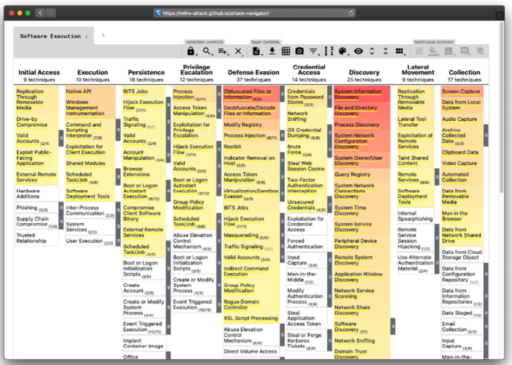

## Initial access

## *Lateral movement*

- First, the attacker gains control of a local user
- Then, escalates to local admin
- Then, moves to the AD (domain admin)
- Then, moves to any computer in the network

## Exfiltration / Impact

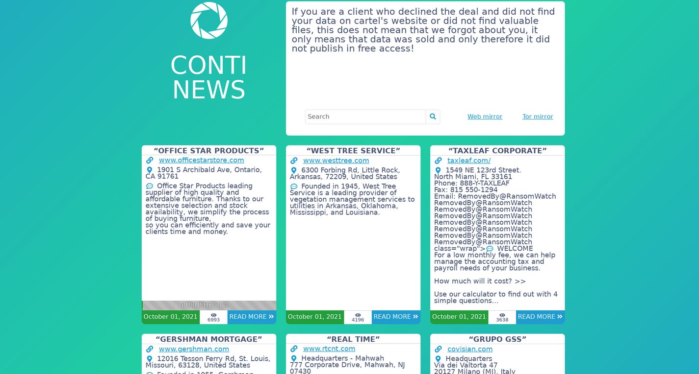

> https://www.ransomwatch.org/

# Defenses
<!-- _class: lead -->

## A change in paradigm
<!-- _class: with-warning -->

- 10 years ago: **protection**. Filter, patch, block
- Currently: **detection**. Log, alert, react

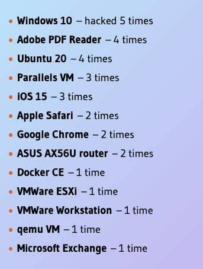

Results of the Pwn2Own hacking contest: https://therecord.media/windows-10-ios-15-ubuntu-chrome-fall-at-chinas-tianfu-hacking-contest/

All systems are vulnerable

## How to protect an endpoint?

- Default system tools
- Enhanced system tools
- Antivirus
- Endpoint detection and response (EDR)

## Sources of information in an endpoint
<!-- _class: smaller-font -->

- System logs
    - Linux: `/var/log`
    - Windows: Event Viewer
- System configuration
    - Linux: `/etc`
    - Windows: System registry
- System cache:
    - Linux: `/tmp`
    - Windows: prefetch, amcache, temp files...
- Application logs
    - Linux `/var/log/APPLICATION`
    - Windows: ?
- RAM, filesystem...

> https://www.sans.org/blog/new-windows-forensics-evidence-of-poster-released/

<!--
The link takes to a SANS poster with lots of information about the artifacts you can check to learn about the activity on a system: opened files, applications... It is a wonderful resource for information, updated often
-->

## Windows: Event Viewer

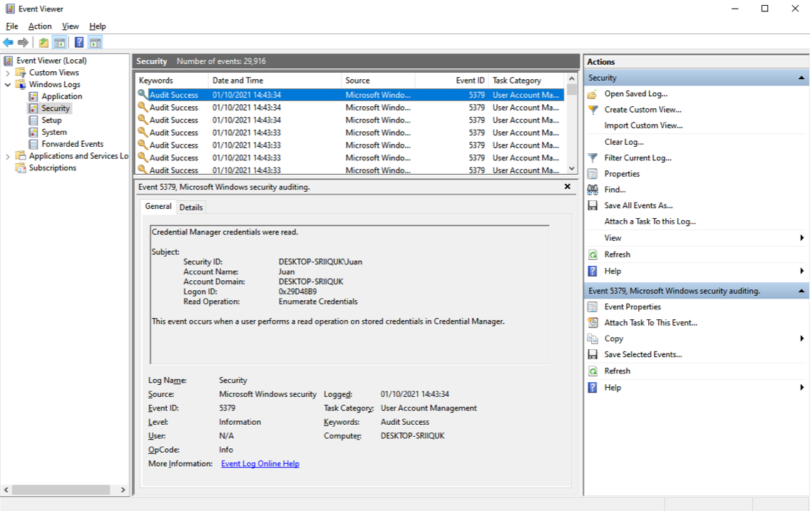

---

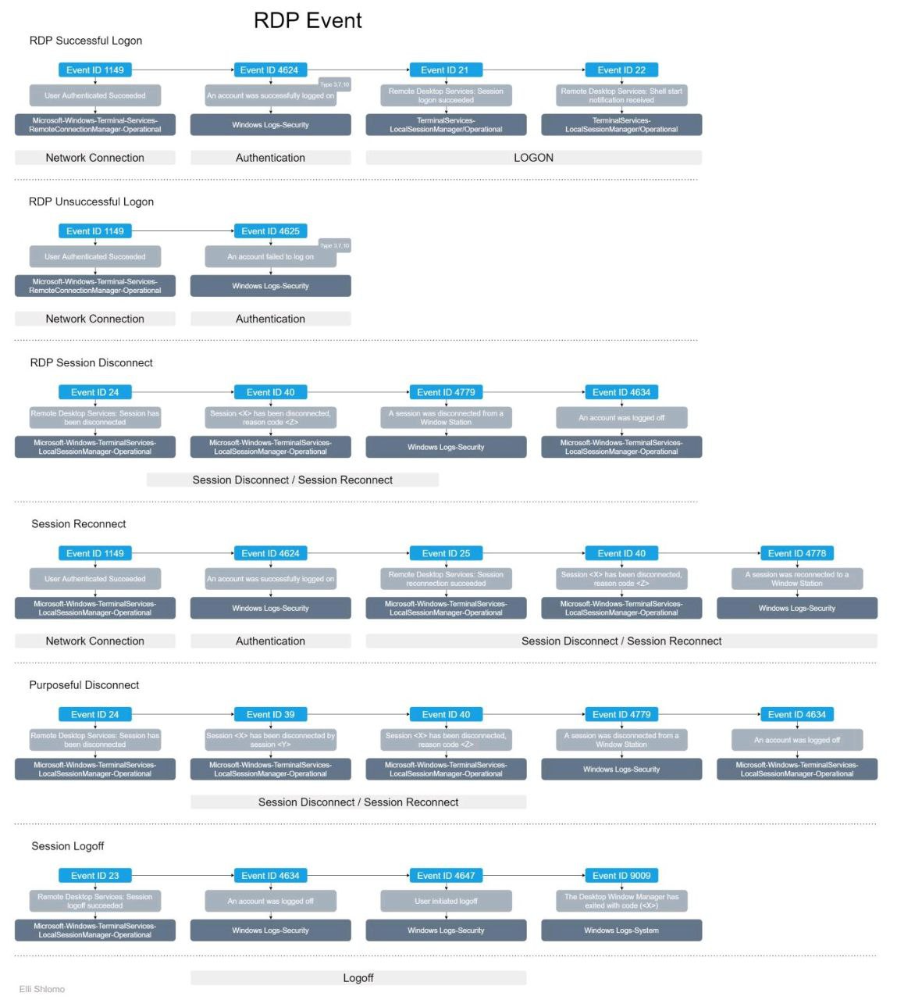

- https://www.ultimatewindowssecurity.com/securitylog/encyclopedia/default.aspx
- https://resources.infosecinstitute.com/topic/6-windows-event-log-ids-to-monitor-now/
- https://www.lbmc.com/blog/top-11-windows-events-to-monitor/
- https://docs.google.com/spreadsheets/d/1BhR3cymZ53ZJfJdKAGKszuB-jgsr8GBJBOCJl50WGKE/edit#gid=326652879

<!--
- Windows events are not designed with security in mind
- They are complex and not very well documented
-->

## Windows applications

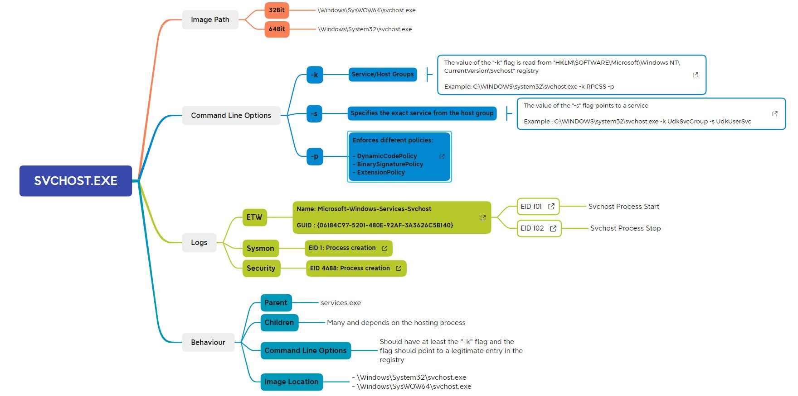

<!--
Important applications, such as svchost (host of system services) has a very well know behaviour

Any deviation is an alarm

Can we monitor this behaviour
-->

## Sysmon

- A Windows system service and device driver for enhanced logs
- Not by default: must be installed explicitly
- Sysmon remains resident across system reboots to monitor and log system activity to the Windows event log
- Sysmon provides detailed information about process creations, network connections, and changes to file creation time
- Outputs wo windows event system (evtx)

> https://docs.microsoft.com/en-us/sysinternals/downloads/sysmon
> https://github.com/SwiftOnSecurity/sysmon-config/blob/master/sysmonconfig-export.xml

---

- Logs process creation with full command line for both current and parent processes.
- Records the hash of process image files using SHA1 (the default), MD5, SHA256 or IMPHASH.
- Includes a process GUID in process create events to allow for correlation of events even when Windows reuses process IDs.
- Includes a session GUID in each event to allow correlation of events on same logon session.
- Logs loading of drivers or DLLs with their signatures and hashes.
- Logs opens for raw read access of disks and volumes.
- Logs network connections, including each connection’s source process, IP addresses, port numbers, hostnames and port names.
- Detects changes in file creation time to understand when a file was really created. - Rule filtering to include or exclude certain events dynamically.

---

Arguments against Sysmon:

- no support
- no central management
- extensive configs put the system under high load
- limited options to customize the output (format)

> https://twitter.com/cyb3rops/status/1539355274942849025

## Osquery

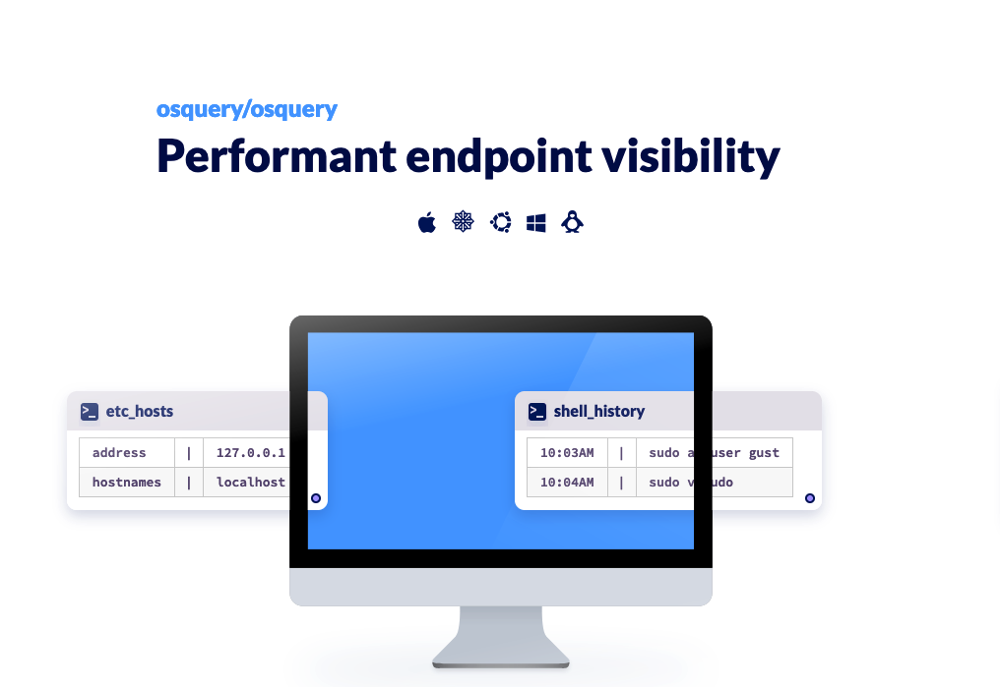

Osquery exposes an OS as a relational database. This allows you to write SQL queries to explore operating system data. With osquery, SQL tables represent abstract concepts such as running processes, loaded kernel modules, open network connections, browser plugins, hardware events or file hashes.

> https://www.osquery.io/

## Challenge

- You must get this data for all your devices
- This is a lot of data!
- Can we automate the process?

## How to protect a Network?

- SIEM
- Endpoint detection and response (EDR)
- Intrusion Detection System (IDS)

## SIEM

A Security Information And Event Management (SIEM) solution supports threat detection, compliance and security incident management through the collection and analysis (both near real-time and historical) of security events, as well as a wide variety of other event and contextual data sources.

---

## Architecture

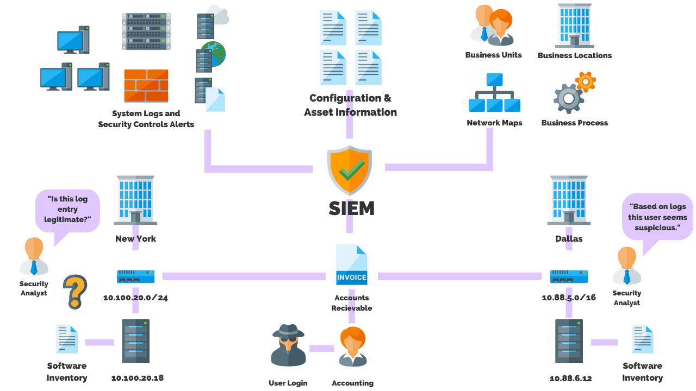

## Challenges

We already have a SIEM in our company. Is it not enough?

- Are you monitoring 100, 1000, or 10000 hosts?
- Do you have budget for commercial tools?
- How heterogeneous is your infrastructure?
- Are you just looking for security alerts, or do you also need persistent event logging for auditing purposes?
- Why do you get that many false positives/negatives? Are you investing time in customizing the alarms?
- What response time do you wish to achieve? Do you need real time notifications?
- Do you have time to improve/tune your solution or do you need something working 100% ASAP?

## OS proposal

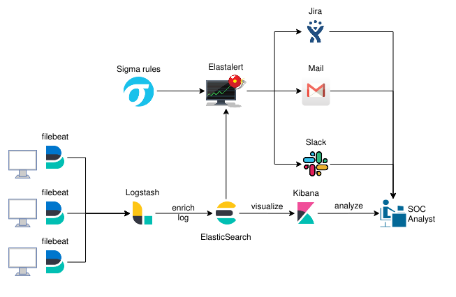

## Wazuh

---

---

## OS Examples

- Elastic: <https://www.elastic.co/siem>
- Elastalert: <https://github.com/Yelp/elastalert>
- HELK: <https://github.com/Cyb3rWard0g/HELK>
- Wazuh: <https://wazuh.com/>

## Commercial examples
<!-- _class: two-columns -->

- QRadar
- Splunk
- Panda WatchGuard

## Endpoint Protection and Response (EDR)

An EDR is a system that monitors (SIEM) and responds, either automatically or manually.

Features:

- Centralized server, gets events from all endpoints
- Manages IOCs and BIOCs (behavior indicators). Examples:
    - executing apps from macros
    - large uploads to servers
    - antivirus
- Response: block an application, remove a IOC, isolate an endpoint

---

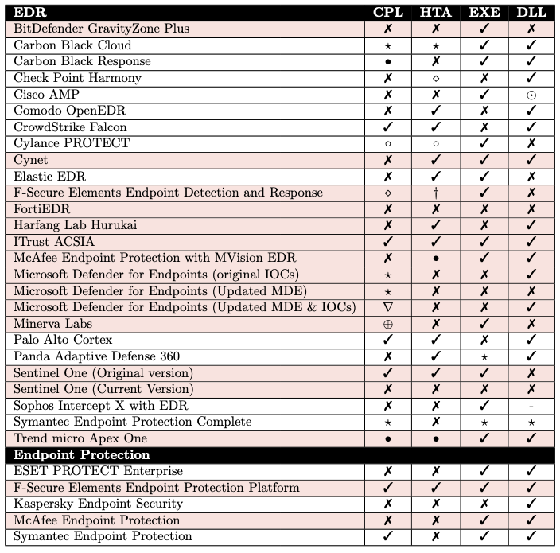

> [An Empirical Assessment of Endpoint Security Systems Against Advanced Persistent Threats Attack Vectors](https://arxiv.org/pdf/2108.10422.pdf) George Karantzas1 and Constantinos Patsakis, 2022. https://arxiv.org/pdf/2108.10422.pdf

# Security Operations Center
<!-- _class: lead -->

## SOC

A centralized team in a single organization that monitors the information technology environment for vulnerabilities, unauthorized activity, acceptable use/policy/procedure violations, intrusions into and out of the network, and provides direct support of the cyber incident response process.

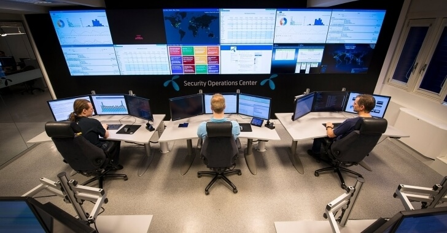

## SOC Services

Reactive:

- Monitoring and alerts
- Incident Response
- Forensics / eDiscovery

Proactive:

- Threat Hunting
- Health Monitoring

## Trained personal

Highly skilled people can produce more accurate and timely results with a moderate product than novices with an expensive toolset.

## Getting into the hunt

Assume that there is a likely compromise, become detection oriented and proactively mine data looking for patterns of intrusion and misbehaviour.

## Define metrics

- Number of data sources
- MTT close an alarm
- Implemented Use Cases
- number of not-reviewed alerts after 24 hours
- ...

## What makes good SOCs good

[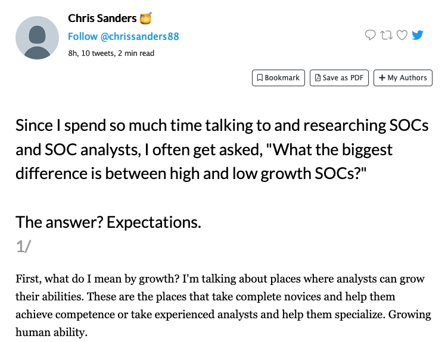](https://twitter.com/chrissanders88/status/1450823790745821188)

# The SOC analyst
<!-- _class: lead -->

## A day as a SOC analyst

- Alarm triage
- Dashboard review
- Review security state
- System health
- Active threat hunting
- Review intelligence data

## Dashboard

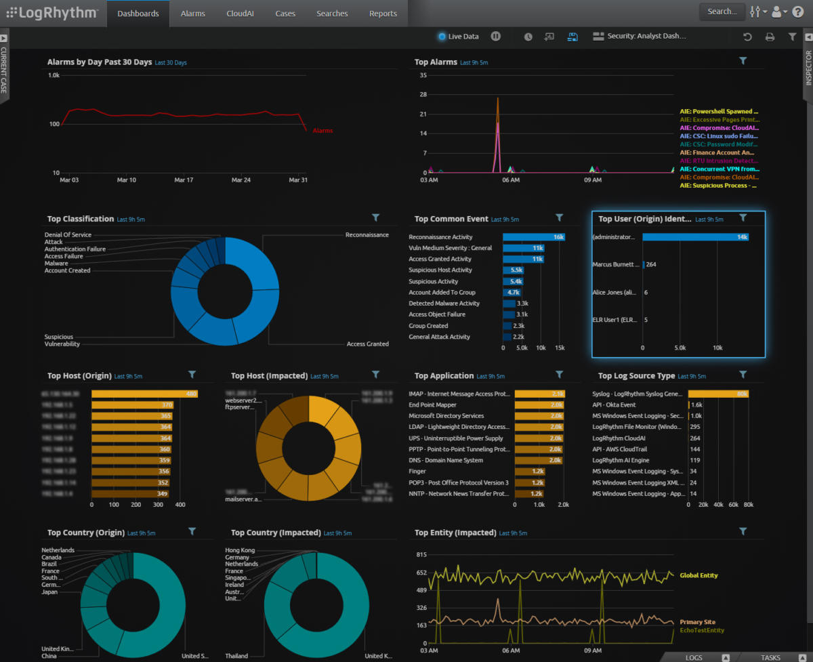

## Indicators of Compromise (IoC)

An artifact observed on a network or in an operating system that, with high confidence, indicates a computer intrusion.

Yara rules:

- <https://github.com/Yara-Rules/rules>
- <https://github.com/Neo23x0/Yara-Rules-2>

---

## Common Vulnerabilities and Exposures (CVE)

Identify, define, and catalog publicly disclosed cybersecurity vulnerabilities.

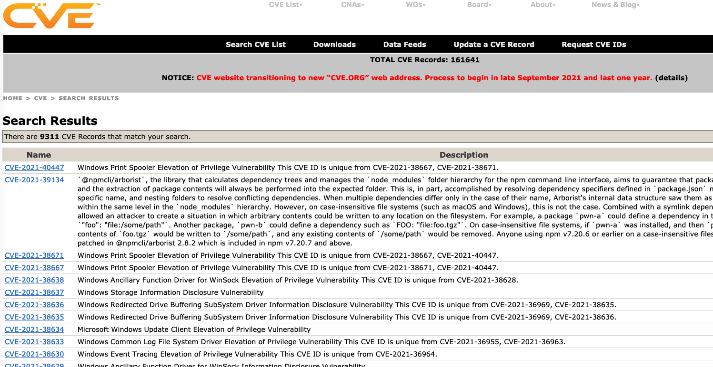

> https://cve.mitre.org/
> https://github.com/trickest/cve

## Reports

- https://us-cert.cisa.gov/
- https://www.fbi.gov/investigate/cyber/news
- https://www.sentinelone.com/labs/
- https://www.ccn-cert.cni.es/ca/pdf/informes-de-ciberseguridad-ccn-cert/informes-ccn-cert-publicos/

## Playbooks

- https://docs.microsoft.com/en-us/security/compass/incident-response-playbooks
- https://gitlab.com/syntax-ir/playbooks
- https://github.com/certsocietegenerale/IRM

## Remote forensics
<!-- _class: center -->

> https://www.youtube.com/watch?v=dmmliSh91uQ

---
<!-- _class: center -->

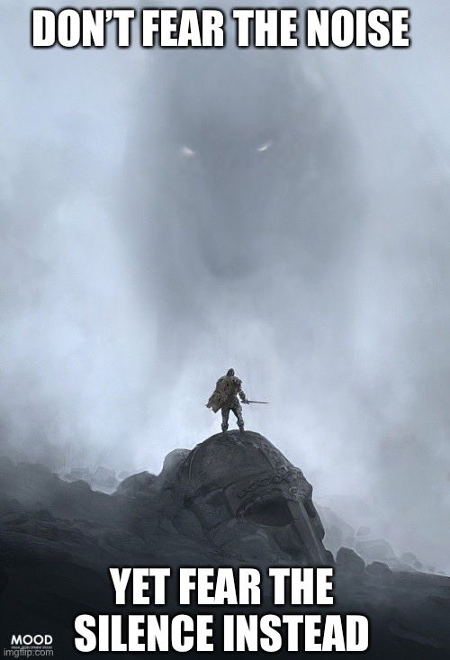 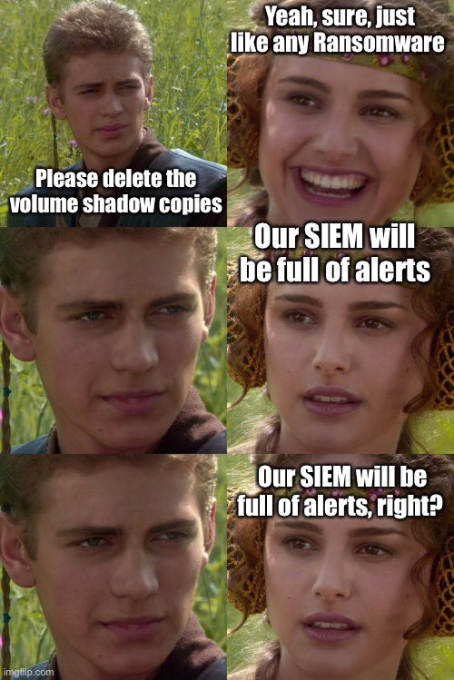

# Recommendations
<!-- _class: lead -->

## Where do I start?

- MITRE ATT&CK® for Enterprise includes over 500 techniques and sub-techniques and the list grows with each release

> https://medium.com/mitre-engenuity/where-to-begin-prioritizing-att-ck-techniques-c535b50983f4

---

 Mick Douglas (@bettersafetynet)

*I've had 3 calls so far today (it's not even 10) about defending against Russian cyber ops. I'm tired of having the same call... so... here's what I've told everyone. This is the playbook you need... but it's not going to be what you think it will be. Ready? Lets go!*

Feb 23, 2022

https://twitter.com/bettersafetynet/status/1496496087741480960

---
<!-- _class: smaller-font -->

1. Watch your egress. Firewalls work both ways. Carefully monitor outbound traffic. DMZ servers RESPOND to external requests. Look for DMZ systems initiating outbound. This is what "phoning home" (aka C2) looks like.
    - you will have a handful of DMZ servers initiating outbound. File xfer systems, any mail server (you likely shouldn't be running your own). Some web services may also initiate outbound.
2. Don't get too hung up on IP address blocks. Geo blocking has some advantages, but the only time Russian groups come from Russian IP space is when they want to rub it in. Start treating the entire internet as hostile... because it is.
3. You 100% must know what is "normal" exes on your systems. App control (used to be call white listing) is no longer a "nice to have" it's IMO table stakes. Anyone who claims otherwise is giving dated & dangerous advice. Use native logging functions to know the apps that are running on systems.
    - EDR
    - Windows SRUM. It has a 30 day rolling view of EVERY exe run
    - auditd or sysmon

---
<!-- _class: smaller-font -->

1. Because many orgs over rely on EDR and SIEM now, LOL attacks are highly successful. Attackers blend in. They are using core parts of the OS against you. None of your tools will stop these. You likely already have exclusions for the ports and protocols these tools use.
    - https://www.youtube.com/watch?v=_8xJaaQlpBo
    - https://www.youtube.com/watch?v=j-r6UonEkUw
    - https://www.youtube.com/watch?v=s19na5Iob6A
1. Don't buy vendor tools to catch the attackers. No matter how good the demo is... it's a demo.
1. If your IR plan doesn't have a rapid (host and network level) isolation workflows. Make it just after the stuff I've talked about in prior tweets. Drill it. You're going to need to work at a speed you likely haven't before.
1. Increase your logging, while both filtering out stuff you don't care about at your aggregators, and SHORTENING the retention length for the data you don't need long term.
1. The playbooks we've been following for too long are now being used against us. You can either accept that, or be beaten before you even show up to fight.

---

That said, you *can* win this fight. Once the attackers are in, you only need to detect them once. You can do stuff like make MSFT an untrusted publisher on a Windows box by allowing ONLY what is listed in SRUM analysis.

Your hosts tell you how they're being used and abused. Start listening.  Prevent isn't possible. Try anyway. Move to a detect and respond model. That's our path to victory.

But it's rare. 

Most orgs? Your exception list will fit on a single sheet of paper.

# References
<!-- _class: lead -->

---

- <https://www.varonis.com/blog/what-is-siem/>
- <https://medium.com/bugbountywriteup/building-a-siem-combining-elk-wazuh-hids-and-elastalert-for-optimal-performance-f1706c2b73c6>

# Thanks!
<!-- _class: last-slide -->
