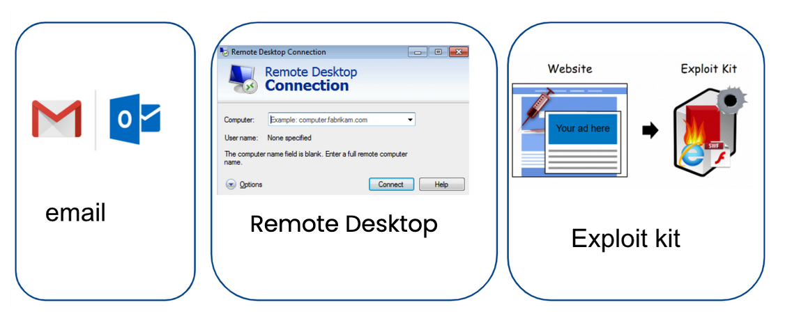

# Cybersecurity Management
<!-- _class: first-slide -->

**The attackers**

Juan Vera - juan.vera@upc.edu

# Contents
<!-- _class: cool-list toc -->

1. [Bad guys](#3)
1. [Types of attacks](#10)
1. [Business model](#20)
1. [Threat Intelligente](#35)
1. [Tools and Techniques](#36)
1. [Ransomware](#45)
1. [Ransomware groups](#50)
1. [Defense](#71)
1. [Example: Babuk](#75)
1. [References](#81)

# Bad guys
<!-- _class: lead white-logo -->

## Ransomware-as-a-service
<!-- _class: center -->

> https://www.upguard.com/blog/what-is-ransomware-as-a-service

<!--
The bad guys have many different motivations: money is the most important motivation, but also stealing industrial secrets or political motivations, as in the previous video.

Being a criminal is not that hard, you only need money to buy the right tools. And they are not event too expensive

- Malware / ransomware creators sell their tools in the black market. It is a completely professionalized business : they have 24/7 technical support from the developers and detailed manuals (playbooks)

- That means that many groups share the same tools and techniques, and they do not need a very deep technical knowledge
-->

---

> https://www.microsoft.com/security/blog/2022/05/09/ransomware-as-a-service-understanding-the-cybercrime-gig-economy-and-how-to-protect-yourself/

## Advanced Persistent Threat Groups

- APT groups try to steal data, disrupt operations or destroy infrastructure.
- APT attackers pursue their objectives over months or years.
- They adapt to cyber defenses and frequently retarget the same victim.

> https://www.varonis.com/blog/apt-groups/
> https://www.fireeye.com/current-threats/apt-groups.html

<!--
Some of these groups are APT. They are focused during large periods of time on a specific victim and they are very well funded and organized.

These groups are very well know and documented!
-->

---

- APT41 is a threat group that researchers have assessed as Chinese state-sponsored espionage group that also conducts financially-motivated operations.
- APT41 has been active since as early as 2012.
- The group has been observed targeting healthcare, telecom, technology, and video game industries in 14 countries.

> https://www.fbi.gov/wanted/cyber/apt-41-group
> https://attack.mitre.org/groups/G0096/
> https://www.fireeye.com/current-threats/apt-groups.html
> https://en.wikipedia.org/wiki/Double_Dragon_(hacking_group)

<!--
This is just an example of one of these groups. Notice:

- The group is perfectly identified
- The group has been active for 10 years
- They are suspected to be supported by the Chinese goverments
- This is APT 41... and that implies that there are at least other 40  groups! Check the link to MITRE, they have the list of other groups and their methods and techniques
-->

## Ramsonware groups in July, 2021

> [Christiaan Beek in Twitter, 2021](https://twitter.com/ChristiaanBeek/status/1427569852357693440)

<!--
Do you notice something funny?

No China, no Russia. These countries are suspected to offer "free haven" to cybercriminals, if they do not attack to companies in their countries

Some ransomware quits without doing any harm if they detect the OS language/keyboard is Russian!

-->

## The bad guys are winning

* There’s a (...) silent, invisible war. It’s fierce and continues to escalate
* They are aggressive, hard-working, learning, inventing and focused on the goal of making money
* They only have to be right once: a vulnerability, a missing patch, a badly secured system, a weak password...
* The criminals are almost never caught

> https://www.forbes.com/sites/davidblack/2021/05/26/cyber-security-heres-why-the-bad-guys-are-winning/
> https://www.infosecurity-magazine.com/next-gen-infosec/cybercriminals-winning-fight/

# Types of attacks
<!-- _class: lead -->

A non-exhaustive list

## Distributed Denial of service (DDoS)

## Man in the middle

## Phishing, spearphishing and business email compromise

## Drive-by attack

## Password attack

## Web vulnerabilities

- Cross-site scripting
- SQL injection

## Eavesdropping attack

## Rogue software attack

## Which security incidents do we see most often?

- Ransomware attacks, data encryption and leaks
- BEC, password phishing attacks, password-compromising malware

These attacks tend to be related to each other (blended attacks)

> https://expel.com/great-expeltations-2022/

<!--
The linked document is a great summary for the incidents in 2021 and 2022
-->

# Business model
<!-- _class: lead -->

## What is your image of an attacker?
<!-- _class: center -->

-screenshot.jpg) 

**Attackers are normal employers of an (evil) company**

## Ransomware-as-a-service

**Subscription-based model**:  affiliates use already-developed ransomware tools to execute attacks

> History 2016-2022: https://www.coveware.com/blog/2022/1/26/ransomware-as-a-service-innovation-curve

<!--
- There are organized groups behind an attak
- They are professionalized: if you pay, you will probably recover your files
-->
## Ransomware-as-a-service: tools

- Initial access to a company: vulnerability, email...
- dropper: (normally, a chain of droppers): applicatoin that downloads the malware
 - "malware": "virus" that infects a system/company
    - Silently moves inside the company and inffects as many systems as possible
    - Executes commands from a Command & Control
    - Uploads information to the C&C.
    - Once it is fully deployed, downloads and run the lockers/crypters
- lockers: application that encrypts a disk. 

## Ransomware-as-a-service: actors

- **Admins**: creators of the platform and user service, they control the unlockers
- **Affiliates**: distributors of the malware, they buy/rent/hire the lockers and the access brokers
- **Access brokers**: initial access to a company

## Triple extortion mechanism

1. **Lockers**: "*Pay us if you want your files decrypted*"
1. **Data leak**: "*We leaked the filed: pay us if you don't want your files public*"
1. **Social pression**: "*We will tell your partners we have their data*"

## Ransomware as a service: RaaS

- Reputation is managed via their unique websites
- Expansion is Raas: a read-made malware
    - easy to deply
    - technical support
    - playbooks
- Benefits:
    - mitigate own risk
    - focus on develpment
    - steady stram of new victims by letting others launch their campaigns

## Requirenments

- Cartel, affiliate partnetship
- Collaboration
    - Actual "positions" available within ransomware cartel groups
    - Recommendation about how to best deplpy
    - "reviews" of ease to use
- Russin speaking operators
- Low techinicla skiils: RDP

## Objective: Double extortion

 - the ransomware operator encrypting data and forcing the victim to pay a ransom to unlock it.
 -   ransomware operators encrypt and steal data to further coerce a victim into paying a ransom. If the victim doesn’t pay the ransom, the ransomware operators then leak the data on a leak site or dark web domain, with the majority of leak sites hosted on the dark web.

---

 At least 16 different ransomware variants are now threatening to expose data or utilizing leak sites, and more variants will likely continue this trend.

- [pestering them by phone and email to lobby the victim organization to pay](https://www.youtube.com/watch?v=htsSaPNgm8s)
- Many ransomware groups have made it part of their routine operations to publish a victim organization’s files to customized dark web sites if they don’t pay.
- The beauty of the double extortion approach is that even when victims refuse to pay for a decryption key — perhaps because they’re confident they can restore systems from backups — they might still pay to keep the breach quiet.
- And a reputation for keeping their word is what makes groups like Conti so feared. But some may come to question the group’s competence, and whether it may now be too risky to work with them.

> https://www.paloaltonetworks.com/blog/security-operations/conti-or-so-i-am-told/

## Cost of Ransomware Business Interruption

- Average case duration in Q4 2021: 20 Days (-9% from Q3 2021)
- Most companies that were able to recover from backups, which is ALWAYS faster than attempting to decrypt data with a threat actor decryptor.
- The cost of business interruption remains the most serious cost to organizations that are impacted by ransomware.

> https://www.coveware.com/blog/2022/2/2/law-enforcement-pressure-forces-ransomware-groups-to-refine-tactics-in-q4-2021

## Ransomware as an unplanned backup

Backups do not stop attackers! Asking for a ransom for NOT PUBLISHING your data is a trend in 2021 

<!--
Dado que los atacantes han visto que se reducen sus ganancias porque las empresas están usando sus backups...

Han decidido que harán extorsión con los datos. Algunos grupos, como Babyk, han anunciado (abril 2021) que no cifrarán más, que se limitarán a robar información y amenazar con publicarla
-->

---

> Check: https://www.ransomwatch.org/

<!--
Ejemplo de una página web de un grupo de atacantes que ha tenido mucho éxito durante 2021: Babyk/Babuk. Aquí se pueden ver sus últimos ataques con éxito y la amenaza de publicar los datos robrados.

Estos grupos tienen páginas en la dark web que son visitable con Tor o similares

- Los investigadors conocen estas páginas
- Los grupos de atacantes conocen estas páginas
- Si tu información está ahí, es necesario darla como comprometida
- En enlace propuesto https://www.ransomwatch.org/ (gestionado por investigadores de seguridad) hace capturas periódicas de las páginas de muchos grupos conocidos que tienen sus páginas en .onion
- Podéis encontrar "List of ransomware groups" en varios sitios. Los enlaces dejan de funcionar a menudo
-->

# Law enforcement takedowns!

- DoppelPaymer Ransomware 1/27/2021
    - FBI has been able to provide decryption keys to the victims
- Emotet Malware Botnet Disruption (1/27/2021)
- Egregor Raas Affiliate Arrest (2/14/2021)
    - Egregor arose after the fall of Maze / REvil group

# Sucessful campaigns

- [Russian hackers breach U.S. government, targeting agencies, private companies](https://www.nbcnews.com/news/us-news/russian-hackers-breach-u-s-government-effort-aimed-agencies-private-n1251057) December 14, 2020
- [SolarWinds hackers are at it again, targeting 150 organizations, Microsoft warns](https://www.nbcnews.com/tech/security/solarwinds-hackers-are-it-again-targeting-150-organizations-microsoft-warns-n1268893) May 2021
- ['Really messy': Why the hack of Microsoft's email system is getting worse](https://www.nbcnews.com/tech/security/really-messy-hack-microsofts-email-system-getting-worse-rcna377) March 2021

The White House has implemented a number of tactics to try to reduce it, including coordinating with countries  such as Poland, South Korea and Ukraine to arrest and at times extradite alleged hackers and sanctioning the cryptocurrency companies that allegedly launder the money extorted. 

> https://www.nbcnews.com/tech/security/biden-gets-praise-cybersecurity-ransomware-persistence-rcna12707 January 20, 2022

# Threat Intelligente
<!-- _class: lead -->

TBD

# Tools and Techniques
<!-- _class: lead -->

## Initial access

- RDP
- Exploit of some vulnerabilit
- Malware, usually sent by email
    - TrickBot, Bazar, IcedID, Hancitor, Emotet...

---

> https://www.coveware.com/blog/2022/2/2/law-enforcement-pressure-forces-ransomware-groups-to-refine-tactics-in-q4-2021

<!--
CVE-2021-34473 and CVE-2021-26855: The top 2 most exploited vulnerabilities were Microsoft Exchange vulnerabilities that allowed for remote code execution (RCE) by an attacker. 

CVE-2018-13379: The third most common vulnerability observed was an issue with Fortinet firewall appliances that allows unauthenticated attackers to download system files via special HTTP resource requests.
-->

---

---

## Tools and techniques

> https://thedfirreport.com/2022/03/07/2021-year-in-review/

---

IOCs:

- webshells,
- unfamiliar tasks
- suspicious poewrshell
- memory dumping

## Persistence

- Scheduled Task
- Add New User 
- Registry Run Key
- AnyDesk, TeamViewer, Splashtop and Atera

## Other analysis

- ryuk https://unit42.paloaltonetworks.com/atoms/ryuk-ransomware/
- ryuk https://unit42.paloaltonetworks.com/ryuk-ransomware/
- emotet https://unit42.paloaltonetworks.com/emotet-command-and-control/
- trickbot https://unit42.paloaltonetworks.com/atoms/trickbot/

# Ransomware
<!-- _class: lead -->

---

> [Ransomware - Anatomy of an Attack](https://www.youtube.com/watch?v=6h9yh_A80fs) ESI & CISCO, 2018

---

- Malware that encrypts the victim's files, making them inaccessible, and demands a ransom payment to decrypt them
- recovering the files without the decryption key is an intractable problem
- difficult to trace digital currencies such as paysafecard or Bitcoin and other cryptocurrencies are used for the ransoms
- Typically carried out using a Trojan disguised as a legitimate file that the user is tricked into downloading or opening when it arrives as an email attachment 
- Also, attackers are known to compromise a company infrastructure and once they are inside, run ransomware

> https://en.wikipedia.org/wiki/Ransomware

---

> https://www.coveware.com/blog/2022/2/2/law-enforcement-pressure-forces-ransomware-groups-to-refine-tactics-in-q4-2021

<!--
El ransomware es uno de los mayores peligros para una compañía, y también uno de los ataques más lucrativos
-->

## Objetive: money

- Encrypt data to ask for a payment
- Data exfiltration acts as further motivation for victims to pay a ransom

<!--
Lockbit: The loose affiliate structure of Lockbit has resulted in a tangible lack of consistency in how stolen data is handled. Lockbit affiliates rarely provide tangible proof of data exfiltration and often fail to provide any proof of deletion of logs of stolen data if paid. All the more reason not to pay them!

Conti: The Conti group is extremely large, and the level of organizational miscommunications that occur is evident. During Q4, victims of Conti had their data posted to the Conti leak site despite paying for that NOT to occur. We also witnessed data posted by accident multiple times. 

Hive: This group has had multiple affiliates defect and take copies of the stolen data with them. The defecting affiliates than attempt to extort the victim a second time or offer to subvert their own organization to destroy the stolen data. Regardless of what is actually happening, the instability of this RaaS operation’s affiliates demonstrates that safe custody, secure deletion, and non-proliferation of stolen data are not deliverables that should be counted on, let alone paid for.

Karakurt: On multiple occasions, this group provided victims ‘proof’ of exfiltration files that belonged to a completely different company. This lack of care and hygiene demonstrates that safe custody of stolen data is not a concern of threat actors. 
-->

# Ransomware groups
<!-- _class: lead -->

Conti

---

<!--
The attackers are well known, wealthy and they do not hide themselves.

They say the plate on that automobile says, in Russian, "THIEF"
-->

---

- APT41 is a threat group that researchers have assessed as Chinese state-sponsored espionage group that also conducts financially-motivated operations.
- APT41 has been active since as early as 2012.
- The group has been observed targeting healthcare, telecom, technology, and video game industries in 14 countries.

> https://www.fbi.gov/wanted/cyber/apt-41-group
> https://attack.mitre.org/groups/G0096/
> https://www.fireeye.com/current-threats/apt-groups.html
> https://en.wikipedia.org/wiki/Double_Dragon_(hacking_group)

<!--
Notice:

- The group is perfectly identified
- The group has been active for 10 years
- They are suspected to be supported by the Chinese goverments
- This is APT 41... and that implies that there are at least other 40 identified groups! Check the link to MITRE, they have the list of other groups and their methods and techniques
-->

---

> https://blog.chainalysis.com/reports/2022-crypto-crime-report-preview-ransomware/

---

> [Christiaan Beek in Twitter, 2021](https://twitter.com/ChristiaanBeek/status/1427569852357693440)

<!--
Do you notice something funny?

No China, no Russia. These countries are suspected to offer "free haven" to cybercriminals, if they do not attack to companies in their countries

Some ransomware quits without doing any harm if they detect the OS language/keyboard is Russian!

-->

---

<!-- _class: smaller-font center -->

Most Common Ransomware Variants in Q4 2021

Rank|Ransomware Type|Market Share %|Change from Q3 2021
--|--|--|--|
1|Conti V2|19.4%|-
2|LockBit 2.0|16.3%|+2
3|Hive|9.2%|+5
4|Mespinoza|4.1%|-2
5|Zeppelin|3.6%|+1
5|BlackMatter|3.6%|+4
6|Karakurt|3.1%|New in Top Variants
6|Suncrypt|3.1%|+2
6|AvosLocker|3.1%|New in Top Variants

> https://www.coveware.com/blog/2022/2/2/law-enforcement-pressure-forces-ransomware-groups-to-refine-tactics-in-q4-2021

<!--
Fijaos que no hay tantas variantes de ransomware: solo unas pocas familias. Fijas también en que cambian muy rápidamente: de las 10 variantes más usadas, 5 han aparecido en los últimos 3 meses y otras 5 han desaparecido. Es un mundo que cambia MUY RAPIDAMENTE

¿Cómo es que hay tan pocas variantes de ransomware?
-->

---

> https://blog.chainalysis.com/reports/2022-crypto-crime-report-preview-ransomware/

## Groups change FAST

> https://blog.chainalysis.com/reports/2022-crypto-crime-report-preview-ransomware/

## Conti

Believed to be based in Russia, Conti operates using the ransomware-as-a-service (RaaS) model, meaning Conti’s operators allow affiliates to launch attacks using its ransomware program in exchange for a fee.

> https://thehackernews.com/2021/11/experts-expose-secrets-of-conti.html

---

On August, 2021, a disgruntled member of the Conti ransomware program leaked the manuals and technical guides used by the Conti gang to train affiliate members on how to access, move laterally, and escalate access inside a hacked company and then exfiltrate its data before encrypting files.

> https://cryptographybuzz.com/ransomware-affiliate-leaks-conti/

<!--
En la imagen hay una parte de los manuales, traducidos al inglés. El material original tiene los manuales solo en ruso.

No hace falta un gran conocimiento técnico para llevar a cabo un ataque de ransomware: puedes comprar el malware y los manuales detallados, y ofrecen un "servicio técnico de cibercriminales" para ayudarte a usarlo. Luego, desarrolladores y atacantes van a medias.

Fíjate: de esta manera, un desarrollador de ransomware no se expone y es poco probable que se le pueda detener algún día. 
-->

---

-  On Feb 2022, a member of Conti ransomware group leaked a trove of data including tools, training docs, and internal chat history.
- Conti made ~65,498 BTC (~$2.88B with today’s BTC price at $44k) from April 21st, 2021, to February 28th, 2022.

## Structure
<!-- _class: smaller-font -->

- Conti maintains many of the same business units as a legitimate, small- to medium-sized enterprise, including a Human Resources department that is in charge of constantly interviewing potential new hires.
    - Coders: Programmers hired to write malicious code, integrate disparate technologies
    - Testers: Workers in charge of testing Conti malware against security tools and obfuscating it
    - Administrators: Workers tasked with setting up, tearing down servers, other attack infrastructure
    - Reverse Engineers: Those who can disassemble computer code, study it, find vulnerabilities or weaknesses
    - Penetration Testers/Hackers: Those on the front lines battling against corporate security teams to steal data, and plant ransomware.
    - Conti appears to have contracted out much of its spamming operations, 
- Conti is merely a rebrand of another ransomware strain and affiliate program known as Ryuk.

> https://krebsonsecurity.com/2022/03/conti-ransomware-group-diaries-part-ii-the-office/
> https://www.paloaltonetworks.com/blog/security-operations/conti-or-so-i-am-told/

## Workers
<!-- _class: smaller-font -->

- Fluctuated in size from 65 to more than 100 employees
- Each Conti employee was assigned a specific 5-day workweek, and employee schedules were staggered so that some number of staff was always on hand 24/7 to address technical problems with the botnet, or to respond to ransom negotiations initiated by a victim organization.
-  Conti made its payroll on the 1st and 15th of each month, albeit in the form of Bitcoin deposits. Most employees were paid $1,000 to $2,000 monthly.
- Conti struggled to maintain a steady number of programmers, testers and administrators in the face of mostly grueling and repetitive work that didn’t pay very well
- The turnover, attrition and burnout rate was quite high for low-level Conti employees, meaning the group was forced to constantly recruit new talent.
  - testing of their malware had to be repeated approximately every four hours to ensure that any new malware detection capability added to Windows Defender — the built-in antivirus and security service in Windows — won’t interfere with their code.
- the Conti gang lost control over countless bots — all potential sources of ransom revenue that will help pay employee salaries for months — because of a simple oversight or mistake.

> https://krebsonsecurity.com/2022/03/conti-ransomware-group-diaries-part-ii-the-office/

## Weapons
<!-- _class: smaller-font -->

- the gang primarily kept tabs on the victim bots infected with their malware via both the Trickbot and Emotet crimeware-as-a-service platforms, and that it employed dozens of people to continuously test, maintain and expand this infrastructure 24 hours a day, 7 days a week.
    - Conti members referred to Emotet as “Booz” or “Buza,” and it is evident from reading these chat logs that Buza had its own stable of more than 50 coders, and likely much of the same organizational structure as Conti.
- budgeted several thousand dollars each month to pay for a slew of security and antivirus tools, both for continuous testing (to see how many products detected their malware as bad), but also for their own internal security.
    -  “Install EDR on every computer (for example, Sentinel, Cylance, CrowdStrike); set up more complex storage system; protect LSAS dump on all computers; have only 1 active accounts; install latest security updates; install firewall on all network.”
    - “When that kind of money and people from the street come in who have never seen that kind of money, how can you trust them 1,000%?”

---
<!-- _class: smaller-font -->

-  Conti invested $60,000 in acquiring a valid license to Cobalt Strike
- Conti’s Human Resources Department budgeted thousands of dollars each month toward employer subscriptions to numerous job-hunting websites
- Internal R&D department
- journalist on their payroll who can be hired to write articles that put pressure on victim companies to pay a ransom demand.
- decent working relationships with multiple people who worked at companies that helped ransomware victims navigate paying an extortion demand in virtual currency.
- For one thing, the insurers seemed to limit their ability to demand astronomical ransom amounts. On the other hand, insured victims usually paid out, with a minimum of hassle or protracted back-and-forth negotiations
- It appears Conti was involved in “SQUID,” a new cryptocurrency which turned out to be a giant social media scam that netted the fraudsters millions of dollars. On Oct. 31, 2021, Conti member “Ghost” sent a message to his colleagues that a big “pump” moneymaking scheme would be kicking off in 24 hours. In crypto-based pump-and-dump scams, the conspirators use misleading information to inflate the price of a currency, after which they sell it at a profit.

> https://krebsonsecurity.com/2022/03/conti-ransomware-group-diaries-part-iii-weaponry/

## Techniques

> https://www.coveware.com/blog/2022/2/2/law-enforcement-pressure-forces-ransomware-groups-to-refine-tactics-in-q4-2021

<!--
Persistence (TA0003): 82% of ransomware attacks had persistence TTPs observed, an increase of 34% points from Q3. Persistence TTPs allow adversaries to keep access to systems despite system restarts, credential changes, or other interruptions that could disrupt their access. Techniques used for persistence include any access, action, or configuration changes that let them maintain their foothold on systems, such as replacing or hijacking legitimate code or adding startup code. The most common sub tactics being: Scheduled Task/Job (T1053) observed in 31% of cases and Create Account (T1136), observed in 39% of cases. Scheduled tasks were leveraged by a handful of groups including Conti, Suncrypt, and Lockbit2.0. The tactic allows malware to remain on the network and continuously run after the initial deployment. 

Lateral Movement (TA0008): 82% of ransomware attacks involve lateral movement with the most common types being Remote Services (T1021) observed in 39% of cases, Exploitation of Remote Services (T1210) observed in 38% of cases, and Lateral Tool Transfer (T1570) observed in 23% of cases.  Lateral Movement consists of techniques used to enter and control remote systems on a network. The primary objective of broad ransomware deployment requires exploring the network to identify and control critical systems. Adversaries might install their own remote access tools to accomplish Lateral Movement or use legitimate credentials with native network and operating system tools, which may be stealthier.

Credential Access (TA0006): 71% of ransomware cases observed Credential Access tactics via either Brute Forcing (T1110) observed 78% of the time or OS Credential Dumping (T1003) observed 22% of the time. Credential Access consists of techniques for stealing credentials like account names and passwords. Techniques used to get credentials include keylogging or credential dumping. Using legitimate credentials can give threat actors access to systems, make them harder to detect, and provide the opportunity to create more accounts to help achieve their goals.

Command and Control (TA0011): 63% of ransomware attacks observed some form of Command and Control with Remote Access Software (T1219) being the most common tactic. This tactic consists of techniques that adversaries may use to communicate with systems under their control within a victim network. Adversaries commonly attempt to mimic normal, expected traffic to avoid detection. There are many ways an adversary can establish command and control with various levels of stealth depending on the victim’s network structure and defenses. Ransomware threat actors are regularly using legitimate remote access software to maintain an interactive session on victim systems. The most common legitimate services observed were AnyDesk, TeamViewer, LogMeIn and TightVNC.

Collection (TA0009): Collection tactics were observed on 61% of cases, with Archive Collected Data (T1560) being the most common. Collection consists of techniques adversaries may use to gather information that are relevant to the adversary's objectives. Frequently, the next goal after collecting data is to steal (exfiltrate) the data. Common target sources include various drive types, browsers, audio, video, and email. Common collection methods include capturing screenshots and keyboard input.
-->

---
<!-- _class: with-warning -->

Next slides have a list of the techniques explained in:

- https://below0day.com/2022/03/02/conti-leaks-tools-and-techniques/
- https://krebsonsecurity.com/2022/03/conti-ransomware-group-diaries-part-iii-weaponry/

Check these links for additional details

If you detect any of these commands, you are already screwed

# Reconn
<!-- _class: smaller-font -->

- Adfind
- Rubeus, toolset for raw Kerberos interaction and abuses
- Invoke-Kerberoast.ps1, Kerberoasting
- SharpChromium, a .NET 4.0+ CLR project to retrieve data from Google Chrome, Microsoft Edge and Microsoft Edge
- Veil’s PowerTools, powershell offensive collections
- Seatbelt.exe, a C# project that performs a number of security oriented host-survey “safety checks” relevant from both offensive and defensive security perspectives
- Net-GPPPassword, retrieves the plaintext password and other information for accounts pushed through Group Policy Preferences
- ShareFinder.ps1, $ADMIN share search utility
- Invoke-SMBAutoBrute.ps1, performs smart brute forcing of accounts against the current domain
- NtdsAudit, an application to assist in auditing Active Directory databases
- SharpView, .NET port of PowerView

## Data Exfiltration

- EXPORT ALL MICROSOFT EXCHANGE MAILBOXES
- EXILF VIA RCLONE
- EXFIL VIA FILEZILLA
- EXFIL VIA MEGANZ

## Remote access

- NGROK
- NGROK SERVICE VIA NSSM
- ANYDESK

## Other

- WinPwn, Powershell Recon / Exploitation
- PEASS-ng, a privilege escalation framework
- dazzleUP, a tool that detects the privilege escalation vulnerabilities caused by misconfigurations and missing updates
- Watson, a .NET tool designed to enumerate missing KBs and suggest exploits for Privilege Escalation vulnerabilities
- Responder, IPv6/IPv4 LLMNR/NBT-NS/mDNS Poisoner and NTLMv1/2 Relay
- SharpHound/Bloodhound, attack path management
- RDP PORT CHANGE
- LSASS WITHOUT MIMKATZ
- DELETING LOGS

# Defense
<!-- _class: lead -->

## Defense against ransomware
<!-- _class: smaller-font -->

- Backup your assests!
- **Not in the same machine**
- Train your employees not to open suspicious links
- Good enpoint protection

> https://insights.sei.cmu.edu/blog/3-ransomware-defense-strategies/
> https://www.cybereason.com/blog/three-keys-to-a-reliable-ransomware-defense-strategy
> https://cloudian.com/blog/new-ransomware-protection-from-veeam-and-cloudian/

---

- Phishing Training and User Education
- Keep up with patching processes
- A modern EDR solution goes a long way (CrowdStrike, SentinelOne)
- Reduce attack surface (Vulnerability Management)
- Quality alerting, monitoring of system and security events (SIEM)
- Zero Trust backup security (Rubrik, Commvault)
- Penetration Testing

## Prevention strategies

- Limit services open to the public internet
    - Use VPN
    - Determine access for users at the firewall
    - OSINT: you are exposing more than you think
- Keep services up to date
- Authenticate users MFA, especially for VPNs
- Backup strategy, following the 321 rule: 3 copies, on 2 types of media, with 1 copy off-site

# Example: Babuk
<!-- _class: lead -->

---

Modern Ransomware and exfiltration

- First, it kills security services: antivirus, backup services...
- Next, it **removes** existing backups and shadow copies
- It uses its own implementation of SHA256 hashing, ChaCha8 encryption, and Elliptic-curve Diffie–Hellman (ECDH) key generation and exchange algorithm to protect its keys and encrypt files

---

1. Babuk uses RtlGenRandom to generate 4 random buffers. Two of which are used as ChaCha8 keys, and the other two are used as ChaCha8 nonces.
1. It will encrypt the second ChaCha8 key using the first key and nonce. After that, the first key is then encrypted using the encrypted second key and nonce.
1. This encrypted first key is treated as the Elliptic-curve Diffie–Hellman (ECDH) private key for the local machine.
1. It generates a shared secret using the local private key and the author’s hard-coded public key.
1. This shared secret goes thorugh a SHA256 hashing algorithm to generate 2 ChaCha8 keys, which are used to encrypt files later.
1. In order to be able to decrypt files, Babuk stores the local public key in the file `ecdh_pub_k.bin` in the APPDATA folder.

---

1. Using FindFirstFileW and FindNextFileW calls, it goes through each directory to look for files and sub-directories.
1. Babuk only goes down 16 directory layers deep, so it potentially does not encrypt every single folders in the drive to save time.
1. For small files that are les than 41943040 bytes or roughly 41 MB in size, the file is mapped entirely and encrypted with ChaCha8 two times.
1. With large files, encryption is a bit different. To save time, the entire file is divided into three equally-large regions. For each of these regions, only the first 10485760 bytes or 10 MB will be encrypted.
1. Babuk uses the two ChaCha8 keys generated from the ECDH shared secret’s SHA256 hash as the encrypting keys and the first 12 bytes of the shared secret as nonce.

---

## Recommendations

- Ransomware uses state-of-the-art encryption mechanisms: files cannot be decrypted without contacting paying the attacker
- Backup your files
- Do not store the backup in the same machine or it will be encrypted as well!
- After a ransomware event, check carefully the attacker is not still inside!

# References
<!-- _class: lead -->

---

- [Credit Card Scammers in the Dark Web](https://www.youtube.com/watch?v=jT-jmq8KBw0)
- [Be aware - how hackers can steal your money](https://www.youtube.com/watch?v=h8-27iLvyS4)
- [Spying on the scammers](https://www.youtube.com/watch?v=le71yVPh4uk)
- [Don’t Wake Up to a Ransomware Attack - CISA](https://www.youtube.com/watch?v=GdXLp1bEnZE)
- [Babuk Ransomware, by McAfee](https://www.mcafee.com/blogs/other-blogs/mcafee-labs/babuk-ransomware/)
- [Babuk Ransomware, by ChuongDong](http://chuongdong.com/reverse%20engineering/2021/01/03/BabukRansomware/)
- [Ransomware: lecciones desde las trincheras](https://ens.ccn.cni.es/es/docman/documentos-publicos/iii-encuentro-ens/553-11-ransomware-lecciones-desde-las-trincheras/file)
- [The DFIR Report: 2021 Year In Review](https://thedfirreport.com/2022/03/07/2021-year-in-review/)
- [The 2022 Crypto
Crime Report - Chainalysis 2022](https://go.chainalysis.com/rs/503-FAP-074/images/Crypto-Crime-Report-2022.pdf)

<!--
Pero vamos a destacar dos recursos que me parecen especialmente interesantes: la introducción al ransomware de John Oliver, que incluye muchos de los conceptos menos ténicos que hemos visto aquí, y el informe 2021 de CrowdStrike, con descripción detallada de ataques actuales.
-->

---

> [Ransomware: Last Week Tonight with John Oliver (HBO)](https://www.youtube.com/watch?v=WqD-ATqw3js)

---

[2021 CrowdStrike Global Threat Report](https://www.crowdstrike.com/resources/reports/global-threat-report/). This year’s highlights include:

- The COVID-19 pandemic and its effect on cybersecurity
- “Big game hunters” targeting the healthcare sector
- Significant nation-state-based targeted attacks and operations observed from China, Iran, DPRK, Russia and others
- The pivotal role that access brokers play in the eCrime ecosystem
- How ransomware adversaries are rapidly adopting data extortion methods
- Recommendations you can take to proactively address emerging threats

# Thanks!
<!-- _class: last-slide -->
