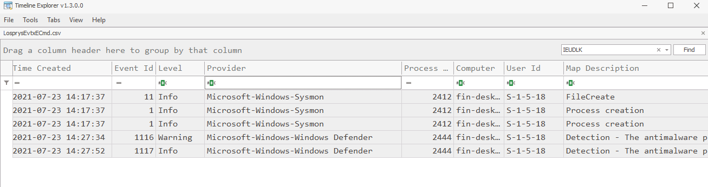

# Cybersecurity Management
<!-- _class: first-slide -->

Incident Response

Juan Vera - juanvvc@gmail.com

# Contents
<!-- _class: cool-list toc -->

1. [Something happened!](#3)
1. [(1/6) Preparation](#10)
1. [(2/6) Identification](#19)
1. [Remediation: (3/6) Containment, (4/6) Eradication and (5/6) Recovery](#26)
1. [(6/6) Lessons learned](#31)
1. [SOCVEL Blue Team Training CFT](#35)

# Something happened!
<!-- _class: lead -->

---
<!-- _class: center -->

<!--
Mr Wolf is an incident responder:

- He knows what to do: experience, knwolege
- Yet, he does nothing: he tells what to do (technics are much better than you to run commands, and they know better their system)
- Mr Wolf "calm the room down"
-->

---

 [4n6lady (@4n6lady)](https://twitter.com/4n6lady/status/1495461164054048769)
Not only do I assist with Incident Response, I also help calm the room down. I bring the client down from panic attacks, anxiety driven fears, and paranoia. I establish trust and comfort from the start. It's one of the most important skills in this field.
(*Feb 20, 2022*)

## Security events

- An employee flags a suspicious email.
- Someone downloads software (authorized or unauthorized) to a company device.
- A security lapse occurs due to a server outage.

## Security incident

A change in a system that negatively impacts the organization

They usually start as "events"

- An employee replies to a phishing email, divulging confidential information.
- Equipment with stored sensitive data is stolen.
- A password is compromised through a brute force attack on your system.

<!--
All incidents are events, but not all events are incidents.

Incidents refer to the more specific events that cause harm to your environment. Security incidents typically happen less often than cybersecurity events.

A security incident always has consequences for the organization. If an event causes a data or privacy breach, it immediately gets classified as an incident. Incidents must get identified, recorded, and remediated. This is why monitoring security events is so important. Organizations must take a proactive approach to lookout for events that could cause serious problems.    
-->

## Incident Response Plan
<!-- _class: cool-list -->

1. [Computer Security Incident Handling Guide - NIST SP 800-61](https://csrc.nist.gov/publications/detail/sp/800-61/rev-2/final)
1. [Guide for Cybersecurity Event Recovery - NIST SP800-184](https://csrc.nist.gov/publications/detail/sp/800-184/final) 
1. [Incident Handler's Handbook - SANS Institute](https://www.sans.org/white-papers/33901/) 
1. [ISO/IEC 27035:2016 - Information security incident management ](https://www.iso27001security.com/html/27035.html)

> https://www.bitlyft.com/resources/what-is-security-incident-response-plan-2
> https://www.cisco.com/c/en/us/products/security/incident-response-plan.html
> https://www.exabeam.com/incident-response/incident-response-plan/
> https://www.cynet.com/incident-response/incident-response-plan/

## The 6-steps of an Incident Response
<!-- _class: cool-list with-warning -->

1. *Preparation*
1. *Identification*
1. *Containment*
1. *Eradication*
1. *Recovery*
1. *Lessons learned*

<!--
 These names and steps are common for all of us.

You are expected to know these steps, what to do in each of them and when you must take the next step!

During the next sections we will explore these steps in depth. Next, there is a summary of them:∫

1. Preparation—review and codify an organizational security policy, perform a risk assessment, identify sensitive assets, define which are critical security incidents the team should focus on, and build a Computer Security Incident Response Team (CSIRT).
2. Identification—monitor IT systems and detect deviations from normal operations, and see if they represent actual security incidents. When an incident is discovered, collect additional evidence, establish its type and severity, and document everything.
3. Containment—perform short-term containment, for example by isolating the network segment that is under attack. Then focus on long-term containment, which involves temporary fixes to allow systems to be used in production, while rebuilding clean systems.
4. Eradication—remove malware from all affected systems, identify the root cause of the attack, and take action to prevent similar attacks in the future.
5. Recovery—bring affected production systems back online carefully, to prevent additional attacks. Test, verify and monitor affected systems to ensure they are back to normal activity.
6. Lessons learned—no later than two weeks from the end of the incident, perform a retrospective of the incident. Prepare complete documentation of the incident, investigate the incident further, understand what was done to contain it and whether anything in the incident response process could be improved.
-->

# (1/6) Preparation
<!-- _class: lead -->

---

- Review and codify an organizational security policy
- Identify sensitive assets: reputation, business info, personal info, payment info
- Define which are critical security incidents the team should focus on
- **Build** and **train** a Computer Security Incident Response Team (CSIRT)
- Have your tools ready and installed
    - Agents
    - Investigative tools
    - Infrastructure: GRR, Velociraptor...
- Set up alternate communication channels
- Educate users

## Documents you must prepare

- Inventory of devices, applications, network configurations and services
- Policies
    - Acceptable use
    - Security policy
    - Password policy
    - Remote access policy
    - Internet usage policy
- Incident Response plan
- Playbooks
- Recovery plan (backup policies)

## Know your systems

## Identify threats, assets and vulnerabilities

**RISK** = an **ASSET** with a **VULNERABILITY** exploited by a **THREAT**

## Prepare a jump bag
<!-- _class: smaller-font -->

- Acquisition software
    - Manual: [RawCopy](https://github.com/jschicht/RawCopy), [SleuthKit](https://sleuthkit.org/), HashMyFiles
    - Integrated: [CyLR](https://github.com/orlikoski/CyLR), [WinTriage](https://www.securizame.com/wintriage-la-herramienta-de-triage-para-el-dfirer-en-windows/), [KAPE](https://www.kroll.com/en/insights/publications/cyber/kroll-artifact-parser-extractor-kape)...
    - Commercial: [FTK Imager](https://www.exterro.com/ftk-imager), [RAM capturer](https://belkasoft.com/ram-capturer)
- Analisys tools
    - [EricZimmerman's Tools](https://ericzimmerman.github.io/#!index.md), [NirSoft](https://nirsoft.net)...
    - [yara rules](https://yara.readthedocs.io/en/stable/), [sigma rules](https://socprime.com/blog/sigma-rules-the-beginners-guide/)
    - Agents: [GRR](https://github.com/google/grr), [Velociraptor](https://docs.velociraptor.app/), [fluentd](https://www.fluentd.org/), sysmon...
    - Autopsy, Volatility, Belksoft, FTK, CrowdStrike...
    - Fast triage: [Chainsaw](https://github.com/WithSecureLabs/chainsaw), [Hayabusa](https://github.com/Yamato-Security/hayabusa)...
- Your printed procedures

---

## Plan your documents

Sample documents and targets:

Name|Delivery target draft-final
--|--
Case Status Report|Daily
Live Response Report|1-2 days
Forensic Examination Report|4-6 days
Malware Analysis Report|3-5 days
Intrusion Investigation Report|5-8 days

Format: an email may be enough for the daily report!

## Playbooks

Check your procedures

- https://docs.microsoft.com/en-us/security/compass/incident-response-playbooks
- https://gitlab.com/syntax-ir/playbooks
- https://github.com/certsocietegenerale/IRM

# (2/6) Identification
<!-- _class: lead -->

---

- Monitor IT systems and detect deviations from normal operations, and see if they represent actual security incidents
- Collect additional evidence, establish its type and severity
- Document everything

## Get the initial facts

- Checklist:
    - Date and time or report
    - Date and time of detection
    - Contact information
    - Nature of the incident
    - Affected resources
    - Who accessed the systems since detection
- Validate facts and establish context

## Build a timeline of the incident

The timeline will be dynamic as you learn new facts

An Excel document is also valid!

> Google Timesketch: https://github.com/google/timesketch

## Act on leads

Leads must be:

- Relevant
- Actionable
- Sufficient detail

Ideally, **they will be converted into IOCs**

Prevent "going down the rabbit hole"

## Gain a better idea of what the attacker did

**Initial detection rarely tells a complete story**

- Entry vector?
- Persistence?
- Data exfiltration?

## Collect data: forensic artifacts

- System events
- Security logs
- User behavior
- User creation
- RAM
- Filesystem
- Network evidence
- ...

> https://github.com/forensicanalysis/artifacts
> https://forensicswiki.xyz/page/Main_Page

# Remediation: (3/6) Containment, (4/6) Eradication and (5/6) Recovery
<!-- _class: lead -->

---

1. **Containment**: perform short-term containment, for example by isolating the network segment that is under attack. Then focus on long-term containment, which involves temporary fixes to allow systems to be used in production, while rebuilding clean systems.
1. **Eradication**: remove malware from all affected systems, identify the root cause of the attack, and take action to prevent similar attacks in the future.
1. **Recovery**: bring affected production systems back online carefully, to prevent additional attacks. Test, verify and monitor affected systems to ensure they are back to normal activity.

## Steps

1. Form the remediation **team**
1. Determine the timing
1. Develop and implement containment actions
1. Develop the eradication action plan
1. Strategic recommendations

## Warning

**Remediating too early or too late is dangerous**

- Too early: you don't know what happened, or whether the attacker is still in the systems
- Too late: the attacker won!

## Negotiations
<!-- _class: center -->

Learn from the attackers

What have they got?

Ask for proof of exfiltration

Gain time

Reduce the request

> https://edition.cnn.com/2021/07/13/tech/ransomware-negotiations/index.html
> https://searchsecurity.techtarget.com/feature/Ransomware-negotiations-An-inside-look-at-the-process
> https://www.newyorker.com/magazine/2021/06/07/how-to-negotiate-with-ransomware-hackers
> https://www.lmgsecurity.com/ransomware-negotiation-dos-and-donts/

# (6/6) Lessons learned
<!-- _class: lead -->

---

No later than two weeks from the end of the incident, perform a retrospective of the incident.

- Complete documentation of the incident
- Investigate the incident further
- Identify whether anything in the incident response process could be improved
- Identify what to improve
    - Additional logs
    - Better configuration
    - Education

## Objectives of final report

- Complete explanation of the incident
- Containment measures
- Eradication measures
- Identify:
    - Entry point
    - Compromised assets
    - Persistence
    - Data exfiltration
- Issue recommendations

## Notify the authorities

If there is private data exfiltration, it is mandatory

- USA: https://us-cert.cisa.gov/incident-notification-guidelines
- Spain: https://www.aepd.es/sites/default/files/2019-09/guia-brechas-seguridad.pdf

# SOCVEL Blue Team Training CTF
<!-- _class: lead -->

<!--
In this section, we are going to do a Capture the Flag exercise

You need training, and you must be fully trained when an incident occurs. You MUST use CTF exercises to train youself. There are many open and paid CTF exercises, be sure to do several of them every year to keep your skills sharp!

In a CTF you usually have a limited time to resolve an incident. An incident is solved when you answer a specific question like "which user downlaoded a file" or "whats the identifier of a file in the /root directory". Hence the name: these are flags, and you must capture them
-->

## Losprys
<!-- _class: center -->

*"The more you sweat in training, the less you bleed in battle"*

https://socvel.com/losprys.html

<!--
This is my proposal for today. It is an easy CTF that can be solved in an hour with the rigth tools. Check the reference section for more CTFs.
-->

---
<!-- _class: with-warning -->

Gerhadus Stephanos was about to switch on the computer that manages one of the largest model train ecosystems in the Southern Hemisphere

On Monday, 24 July 2021, an apparent "cyber security" event at the company had forced them to shut down all systems. Sounds like a ransomware event, or “losprysware” in Afrikaans...

Can you help solve what happened?

These events were orchestrated using known TTPs used by attackers in current Ransomware attacks. 

Malicious domains contained in the logs could still be live. The same goes for malicious powershell scripts

---

 The incident response team has only been able to obtain the folder `[Microsoft windows installation path]\System32\winevt\Logs`, where the operating system event logs are located.

 They also inform us that System Monitor — Sysmon (an application that expands the log storage capacity of Microsoft Windows) is installed.

 ## Analysis Tools

- OpenSource Intelligence (OSINT)
- Windows Event Viewer
- The CSV was produced with [EvtxCmd](https://ericzimmerman.github.io/#!index.md)
    - TimelineExplorer: https://ericzimmerman.github.io/#!index.md
- [grep, ag, ripgrep](https://beyondgrep.com/feature-comparison/)...

## Chainsaw

A powerful ‘first-response’ command line tool (Linux, Windows, OSX) to quickly identify threats within Windows event logs. It offers a generic and fast method of searching through event logs for keywords, and by identifying threats using built-in detection logic and via support for Sigma detection rules.

https://github.com/WithSecureLabs/chainsaw

Alternatives: [Hayabusa](https://github.com/Yamato-Security/hayabusa), [APT-Hundet](https://github.com/ahmedkhlief/APT-Hunter)...

<!--
Logs are huge and you don't know all possible threats. Manually inspection of the Windows log system is not alware possible or efficient. Any automatic tool that can assist in the process of finding IOCs is wellcome

There are many alternatives. This slide presents Chainsaw and also includes Hayabusa and APT-Hunder. You must use any tool with a database updated to the last threats, probably using yara or sigma rules
-->

---

Q1: what was the likely Ransomware variant deployed on the host?

---

**A1: CONTI**

Google: KKBKR ransomware

https://www.clearskysec.com/wp-content/uploads/2021/02/Conti-Ransomware.pdf

https://en.wikipedia.org/wiki/Conti_(ransomware)

---

**Q2: Did the antivirus Windows Defender detected any trojan?**

Hint: File `Microsoft-Windows-Windows Defender%4Operational.evtx`

---

**A2:  Win64 / IceID.S! MSR was detected in the file C:\Users\finance\IEUDLK.CJF.**

With chainsaw: `chainsaw hunt winevt/Logs`

---
<!-- _class: two-columns smaller-font -->

*In this campaign, we tracked that the malicious email that arrives in the recipient’s inbox from the contact form query appears trustworthy as it was sent from trusted email marketing systems, further confirming its legitimacy while evading detection. As the emails are originating from the recipient’s own contact form on their website, the email templates match what they would expect from an actual customer interaction or inquiry.*

https://www.microsoft.com/security/blog/2021/04/09/investigating-a-unique-form-of-email-delivery-for-icedid-malware/

---

**Q4: When was the IcedID file, which was detected by the antivirus solution, first created on the system?**

---
<!-- _class: with-warning -->

**A4: 2021–07–23 14:17:37**

With chainsaw: `chainsaw search -s IEUDLK.CJF winevt/Logs`

Note: in windows logs, the timezone is always UTC. **Other artifacts may be in a different timezone**

Normally, you will check this date in the MFT, not the sysmon events. File events will fill the space available to logs quite fast

---

**Q5: which user account on the system was likely responsible for causing the IcedID infection?**

**Q6: Which application was the finance user profile using which was most likely responsible for creating the IcedId file on the computer?**

**Q7: Where was the malware downloaded from?**

<!--

A5: finance
A6: Excel
A7: rlvq27rmjej02sfvb.com

- Check the complete path of the file: C:\Users\finance\IEUDLK.CJF
- Check payload 3 in timeline explorer: C:\Program Files (x86)\Microsoft Office\root\Office16\EXCEL.EXE

-->

---
<!-- _class: with-success -->

**A7:  rlvq27rmjej02sfvb[.]com**

Check DNS after the file creation event

**NOTE**: do not visit the domain, it is really from an attack group. In a report, you would want that the domain cannot be clockedeven by mistake

**Containment**: Now, we can block the domain in the firewall and prevent other users in the company to download the malware

---

**Q11: What was the filename of the spreadsheet opened which caused the infection?**

---

Answer: process creation at 14:15

`"C:\Program Files (x86)\Microsoft Office\Root\Office16\EXCEL.EXE" "C:\Users\finance\AppData\Local\Temp\Temp1_Invoice.zip\Invoice-2021-06.xls"`

Notice: Temp directory, inside a .zip file named "Invoice.zip"

This is probably one of the two most common entry points of malware in a company: fake invoices in emails.

The other most common entry point is RDP

---

A maveric analyst was able to get you the MD5 hash of the second stage IcedID file downloaded to the host: 6d912f3cb045cfce88c96f0da2addf3b

You’d like to add that to the Antivirus for blacklisting. However, your AV needs the hash in SHA256 format.

**Q13: What is the SHA256 hash of the file?**

Hint: <https://www.virustotal.com>

You can analyze the behavior of malware in cuckoosandbox, joesandbox, any.run...

---

**Q15: Which application was responsible for creating the Invoice.zip file on the computer?**

Just search "Invoice.zip", the container of the xls file: `C:\Users\finance\AppData\Local\Microsoft\Windows\INetCache\Content.Outlook\O5GLAIMK\Invoice.zip`

---

**Q16: What was the name of the first malicious service installed on the host following the IcedID infection?**

Hint: EventID 7045 "A new service was installed in the system": https://www.manageengine.com/products/active-directory-audit/kb/system-events/event-id-7045.html?event-log-library

---

Notice the commands: cmd.exe, powershell, echo...

You can decode the command in: https://gchq.github.io/CyberChef  Hint: Base64+gunzip

---

**Q17: Based on the logs, from which IP address did the attackers connect from when installing the malicious service?**

---
<!-- _class: with-warning -->

**10.10.10.99**

This is an IP in the local network! We have a new computer to analyze!

---

Complete writeup: https://medium.com/@inginformatico/forensic-challenge-losprys-ii-writeup-eng-f0c2de13bcc3

CTFs are a very good way to train your skills. This is a list of some of them: https://ctfsites.github.io/

Sometimes, you can find "writeups" of a CTF for the solutions

# Thanks!
<!-- _class: last-slide -->