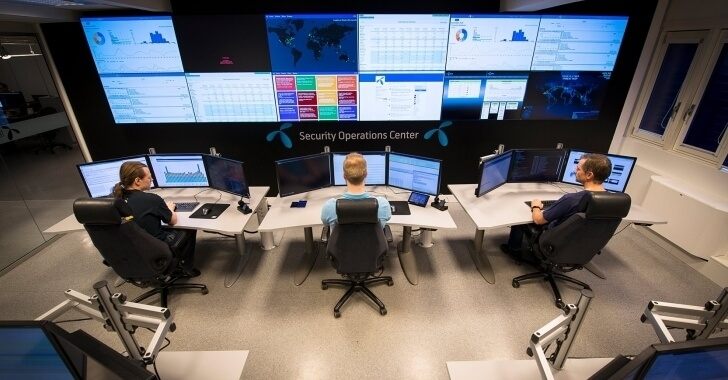

# Cybersecurity Management
<!-- _class: first-slide -->

Presentation

## Faculty

- Manel Media
- Josep Pegueroles
- Juan Vera

## Assesment

- 50% presentation / work
- 30% discussions on other students presentation
- 20% attendance

## Examples of possible topics

1. The careers in cybersecurity
3. Artificial Intelligence and Data protection
4. Red, blue and purple teams
5. Cyber Breach and Attack Simulations
6. Governance of cybersecurity (the hiden key)
7. SOC, SIEM and Threat Hunting
8. Cibercrime Economy
10. Secure electronic voting systems
11. Cyberwarfare
12. Online scams

